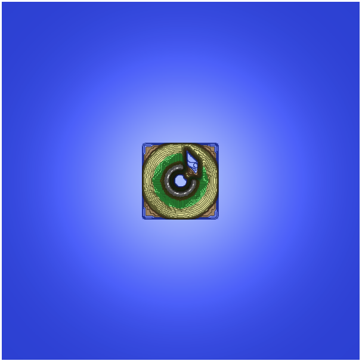

# MAC0420 - Introdução à Computação Gráfica

Oferecimento da disciplina no primeiro semestre de 2021, com o professor Carlos H. Morimoto, no Instituto de Matemática e Estatística da USP.

## Notas de aula

As notas de aula foram baseadas nos slides da disciplina e outros materiais disponíveis.

## Exercícios programa
Os exercícios-programa foram feitos com Javascript canvas e WebGL2.

### EP1: Visualização de Fractais

Implementação de um programa para visualização de fractais definidos pelos conjuntos Mandelbrot e Julia-Fatou. 

O programa permite as seguintes operações:

- **Reset** pela tecla `r` (e também `R`): o canvas deve voltar a condição inicial dos conjuntos Mandelbrot e Julia-Fatou.
- **Shift** (código ASCII = 16): ao segurar a teclas `SHIFT`, usuáries podem selecionar um retângulo sobre a janela exibindo o conjunto Mandelbrot. Para isso usuáries devem clicar em um ponto inicial, arrastar o mouse e soltar o botão sobre um segundo ponto. Tudo isso segurando a `SHIFT`. O retângulo define uma nova área do plano complexo a ser exibida, e seu programa deve atualizar a janela Mandelbrot para exibir o conteúdo do plano complexo do retângulo selecionado.
  - Observe que essa função deve funcionar independentemente da ordem em que o mouse é pressionado e solto (exemplo, canto inferior-esquerdo para superior-direito, ou superior-esquerdo para inferior-direito etc.).
- **Novo c**: sem apertar a `SHIFT`, um clique do mouse sobre um ponto no conjunto Mandelbrot seleciona um novo ponto complexo c. O seu programa deve atualizar o conjunto Julia-Fatou com esse novo valor. Nada deve ocorrer se o botão for pressionado sobre a janela de Julia-Fatou.

### EP2: Paredão 2D

Implementação do jogo "paredão", na qual o indivíduo deve destruir todos os tijolos rebatendo uma bolinha na direção deles, utilizando uma raquete.

A **interface** do jogo se dá pelas seguintes teclas:

- `A` ou `J`: faz a raquete se mover para a esquerda com velocidade constante.
- `S` ou `K`: a raquete para de se mover.
- `D` ou `L`: a raquete se move para a direita com velocidade constante.

Os **botões** acima do canvas podem alterar o modo do jogo da seguinte maneira:

- `Jogar` / `Pausar`: o botão inicia ou pausa o jogo.
- `Depurar` / `Jogar`: ao clicar no botão “Depurar”, o programa entra em modo de “depuração ligada”. Quando ligada, o jogo é interrompido (a bola para) e o botão “Jogar / Pausar” muda seu rótulo para “Passo”. Ao clicar em “Passo”, o jogo avança apenas um passo da animação.
  - no modo de depuração, algumas mensagens aparecem no console do Javascript.
- `Limpar`: ao clicar nesse botão o aplicativo volta à condição inicial.

Também é possível utilizar os **sliders** para mudar algumas propriedades do jogo:

- `Velocidade da bola`
- `Tamanho da raquete`

### EP3: Simulador de vôo - Parte I: cenário e iluminação

Nessa primeira parte, trabalhei na visualização da cena. Para isso, tive que construir uma cena a partir de um mapa de elevação, programar shaders para usar o modelo de iluminação de Phong, usando vários materiais diferentes e implementar alguns botões para ajudar a controlar e depurar a iluminação da cena.

Os **botões** acima do canvas podem alterar a visualização da seguinte maneira:

- `R++ / R--`: aumenta/diminui o raio do modelo da câmera. Na prática, aproxima/afasta a câmera do cenário.
- `theta++ / theta--`: rotação no cenário, alterando o ângulo `theta`
- `phi++ / phi--`: rotação no cenário, alterando o ângulo `phi`

A parte opcional (de subdivisões e escala) não está implementada.

### EP4: Simulador de vôo - Parte II: animação e interação em 3D

O objetivo deste trabalho é continuar a prática de desenho de objetos 3D usando o modelo de iluminação de Phong e shaders, agora de uma forma interativa. Nesse projeto continuamos o desenvolvimento do simulador de vôo para aplicar o mapeamento de texturas sobre as aeronaves e a interface para controlar o simulador.

A **interface** do simulador se dá pelas seguintes teclas:

- `J` e `L`: decrementa/incrementa a velocidade de translação
- `K`: a velocidade de translação é zerada 
- `I` e `O`: altera a posição da câmera. `I` faz a camera chegar até o nariz enquanto `O` faz a câmera se afastar
- `W` e `X`: incrementa e decrementa a rotação em `x` (*pitch*)
- `A` e `D`: incrementa e decrementa a rotação em `y` (*yaw*)
-  `Z` e `C`: incrementa e decrementa a rotação em `z` (*roll*)
- `S`: zera todas as velocidades de rotação

Os **botões** acima do canvas podem alterar o modo do simulador da seguinte maneira:

- `Jogar` / `Pausar`: o botão inicia ou pausa o simulador.
- `Passo`: ao clicar no botão “Passo”, enquanto o simulador estiver pausado, ele avança apenas um passo da animação.