# MAC0420 - Introdução à Computação Gráfica

Oferecimento da disciplina no primeiro semestre de 2021, com o professor Carlos H. Morimoto, no Instituto de Matemática e Estatística da USP.

**Bibliografia:**

1. [Interactive Computer Graphics: a top-down approach with WebGL, Edward Angel, 7th edition](https://www.pearson.com/us/higher-education/product/ANGEL-Interactive-Computer-Graphics-A-Top-Down-Approach-with-Web-GL-7th-Edition/9780133574845.html). Existe uma 8a edição no formato eletrônico.
2. [Introduction to Computer Graphics, David J. Eck, Versão 1.2](http://math.hws.edu/graphicsbook/). Esse material está disponível para download e também ser apreciado online.
3. [Notas de aula de CMSC427 - Computer Graphics](http://www.cs.umd.edu/class/fall2013/cmsc427/) do professor [Dave Mount](http://www.cs.umd.edu/users/mount/).

**Avaliação:**

- Exercícios-programa
- Provinhas

## Introdução

**Objetivo:**

- Gerar imagens de objetos 3D usando um computador

- Fazer o computador ~~desenhar/pintar~~ renderizar

  

**Ferramentas:**

- WebGL

### Um pouco de história

- **Constrained-based drawing:** quadrado - posição e escala
- **Hierarchical model:** objetos e partes X imagens
- **Vector graphics:** descrições X imagens

#### Imagens raster x vetoriais

- Imagem *raster*: matriz de pontos (rasterização é quebrar a imagem em pixel)
- Imagem vetorial: lista de pontos

#### Sistemas gráficos

- monitores antigamente eram vetoriais (vector graphics)

- LCD: sistema gráfico *raster*

- **Um problema**
  
  - Traçar uma reta entre 2 pontos em um monitor com imagem *raster*
    - Falta de continuidade: problemas de *aliasing* (a reta na verdade se torna conjuntos de blocos, ou seja, pixels) -- problema de quantização
    - Esse problema pode ser resolvido se os pixels deixarem de ser binários e passam a ter níveis de cinza entre 1 byte
  - IDEIA: algoritmo de Bresenham, para linhas
  - Hipótese: $\theta < 45º$
  
  ```pseudocode
  f(x0, y0) = 0
  próximo ponto deve ser f(x0+1, y0) ou f(x0+1, y0+1)
  quanto vale f(x0+1, y0+1/2)?
  se positivo, próximo é y0+1
  caso contrário é y0
  
  para encontrar o meio: D = f(x0+1, y0+1/2) - f(x0, y0)
  se D < 0:
  	pinte (x0+1, y0)
  	D += A # soma dy
  senão:
  	pinte (x0+1, y0+1)
  	D += A + B # soma dy - dx
  ```
  
  O algoritmo só precisa de soma, subtração e *shift* (divisão por 2) -- é um algoritmo muito eficiente
  
- Sistema gráfico *raster* com processador gráfico

## O domínio da computação gráfica

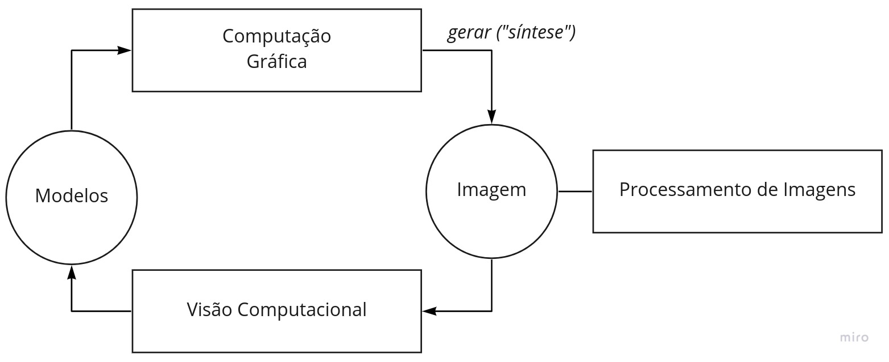

### Elementos gráficos

- **pixel** = *picture element*, é a unidade na qual trabalharemos
  - pode ter valor binário (0 | 1), cinza (1 byte, ou seja, [0,255]), ou cor
- **desenho** = formas geométricas, polilinhas -> **vetoriza**
  - linhas abertas 
  - linhas fechadas (polígono) --o conceito de dentro e fora
  - linhas podem se cruzar ou não
- **pintura** = nasce do polígono: pintar  que está dentro, ou pintar o que está fora, ou a borda -> **rasteriza**
  - pintar é modificar propriedades de elementos gráficos

### Informações da cena

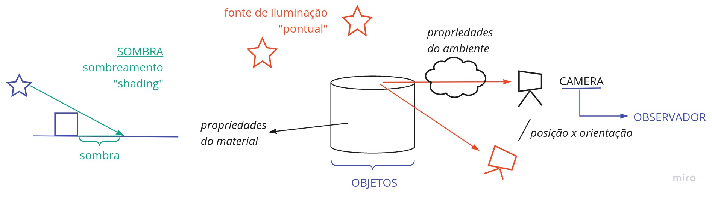

### A Câmera

- "Plano de imagem" -- a imagem está na câmera

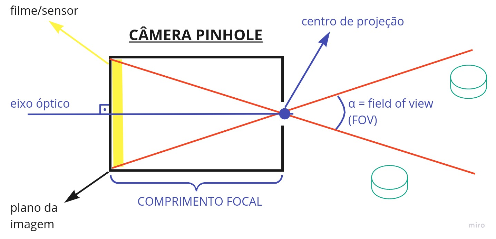

- Além da posição e da orientação, o **zoom** definido na câmera também modifica a imagem

- O **FOV** é inversamente proporcional ao comprimento focal e ao zoom

### A Imagem

- **W**idth: largura da imagem
- **H**eight: altura da imagem
- **W/H**: *aspect ratio*

- Pixel: profundidade
  - Número de bits
    - 1 bit - binária, 
    - 8 bits - cinza, 
    - 24 bits - RGB, 
    - 32 bits - RGBA  (canal alfa para opacidade ou profundidade)

### Cor

- Comprimento de onda (eletromagnética) ou partícula (fóton) 
- Percepção - constância de cor

* *Halftoning* - impressoras


## Javascript Canvas

- Callbacks (eventos)
- Máquina de estados
- Código dentro do diretório `javascript_examples`

## Fractais

- Qual o perímetro da costa da Escócia?
- Dimensão fractal

  - 1 dimensão: linha
    - 1 $\epsilon$-bola
    - Quantas bolas de tamanho $\frac{\epsilon}{2}$ são necessárias para cobrir o mesmo objeto? $2$
    - $\frac{1}{a} \implies$ vou precisar de $a$ vezes mais bolas
  - 2 dimensão: plano
    - 1 bola de tamanho $\epsilon$
    - Quantas bolas de tamanho $\frac{\epsilon}{2}$ são necessárias para cobrir o mesmo objeto? $4$
    - $\frac{1}{a} \implies$ vou precisar de $a^2$ vezes mais bolas

  - Triângulo de Sierpinski
    - $N(A, \epsilon) \rightarrow $ menor número de $\epsilon$-bolas para cobrir $A$ 
    - $\frac{1}{2}^d \approx 1.58...$ 
- Funções iteradas

  - $z \rightarrow z^2$
- Números complexos
- Atratores
- Conjuntos de Julia: $z \rightarrow z^2 + c$

## WebGL e o Pipeline Gráfico

### No canvas...

- Como funciona uma **API 2D** (Application Programming Interface)
  - canvas do HTML5 — usa um modelo *pen-plotter* (controle de uma "caneta" por meio de deslocamento nos eixos $(x,y)$)
  - `moveTo(x0,y0)` e `lineTo(x1,y1)`

### API 3D

#### Processo de formação de imagem

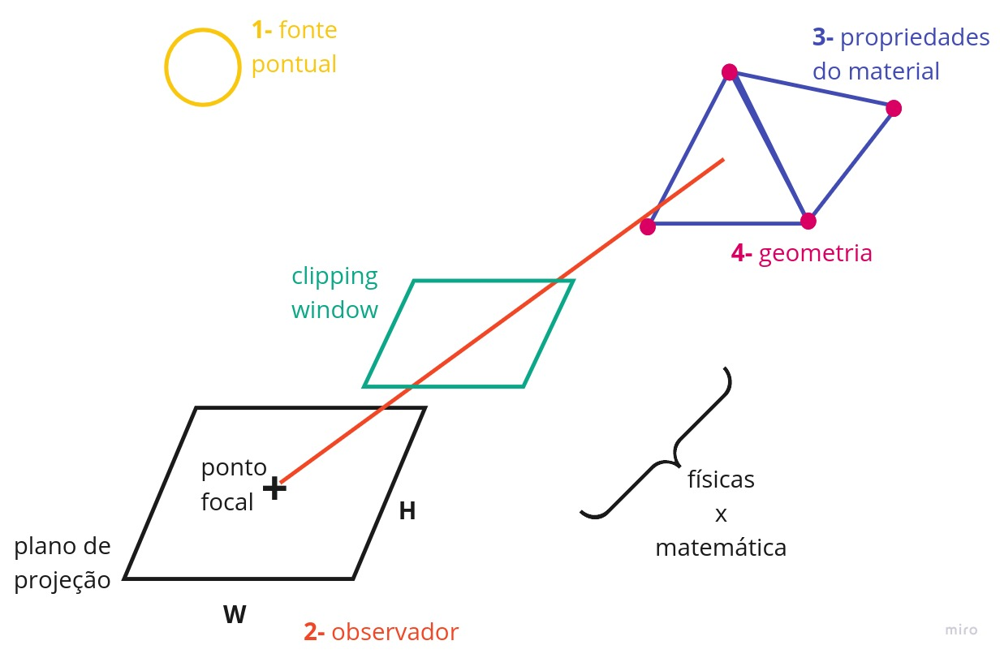

#### Hardware

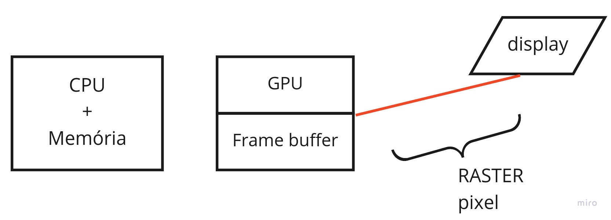

- Framerate $\neq$ framebuffer

### Raytracing 

- **Ray casting:** projetar cada pixel na imagem e checar se ele incide no objeto, se sim, pegar a cor (dada pela função da superfície e sua interação com a fonte de luz)
- **Ray tracing:** não é só uma função da superfície e sua interação com a fonte de luz — pode haver espelhos (reflexão), objetos fazendo sombra em outros, refração
- Computacionalmente muito caro

### Pipeline gráfico

- Primitivas geométricas: vértices, linhas e triângulos
- Calcular interação das primitivas geométricas com cores, superfícies
- Projetar objetos matemáticos (que já conhecemos) na imagem

- Geometria (linhas e vértices) $\rightarrow$ RASTER (pixels)
  - Linha de produção: paralelização

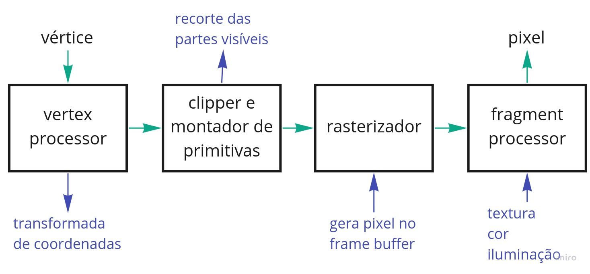

- **Processador de vértices**
- **Clipping e montagem de primitivas**: além do plano delimitado pelo *field of view* ($\approx 90º$), o cone da *clipping window* é truncado em "perto" e "longe"  
- **Rasterização**
- **Processador de fragmentos**

### OPENGL - Open Graphics Library

#### Histórico

- Silicon Graphics (SGI) — IRIS — **IRIS GL** (específico para uma arquitetura)

- **OpenGL 1.0** (1992) — *immediate-mode graphics* 
  - CPU gera os vértices
  - Problema $\rightarrow$ não tinha memória
- **OpenGL 2.0** (2004) — OpenGL Shading Language (GLSL)
  - Permite criar ***shaders*** $\rightarrow$ roda na GPU
  - *retained-mode graphics*
- **OpenGL 3.0** (2008) — não dá mais suporte ao *immediate-mode*

- Dispositivos móveis — **OpenGL ES** (*Embedded Systems*)
  - OGL ES 1.0 (2003) — OpenGL 1.3
  - OGL ES 2.0 (2007) — OpenGL 2.0
  - OGL ES 3.0 (2012) — OpenGL 3.0
- **WebGL 2.0** — OGL ES 3.0
  - suporta *shaders*
- Outras libs ainda usadas: **Direct X**

#### Medidas de desempenho

- **Triângulos por segundo** — geometria (front-end)
  - Capacidade de renderização
  - Quantas primitivas geométricas são desenhadas por medida de tempo
- **Movimentação de dados** (back-end)
  - Through-put
  - Capacidade da placa de mandar informação para o frame buffer

- Frame buffer com **float** — HDR
  - Processamento mais detalhado

#### Exemplo

Função em OpenGL:

- Immediate mode

````pseudocode
function desenhe_Julia()
	init
	for cada ponto:
		calcule e
		pinte o ponto # display
    clean
````

- Retained mode

````pseudocode
function desenhe_Julia()
	init
	for cada ponto:
		calcule e
		salve o ponto em Q  # matriz salva na placa gráfica
	display Q
    clean
````

Mas ainda não conseguimos mudar o `Q`...

- Shaders

````pseudocode
function desenhe_Julia()
	init
	for cada ponto:
		calcule e
		salve o ponto em Q
	enviar Q # shader
	display Q 
    clean
````

O shader roda na GPU

### API 3D

- Para desenhar em 3D: queremos escolher o **sistema de coordenadas (SC)**, independente do dispositivo
- **Em 2D** (vimos no canvas)...
  - Mapeamento mundo $\rightarrow$ dispositivo
  - Manter aspect ratio X distorcer — depende da aplicação

**O que uma API 3D deve oferecer?**

1. **Funções de desenho**:

   - Na forma de primitivas geométricas
   - **Vértice** (consiste de um ponto e outros atributos/propriedades: cor, textura, transparência, normal, etc) $\neq$ ponto (posição no espaço)
     - **2 vértices podem representar**:
       - 2 vértices
       - segmento de reta
       - retângulo
       - circunferência (centro, ponto $\in$ borda)
     - **3 vértices:**
       - triângulo (o polígono mais simples)
       - circunferência (pontos $\in$ borda)
   - **Linhas**
   - **Triângulos**
   - Ideia: decompor objetos 3D em triângulos
   - Associar propriedades às primitivas 

2. **Funções de definição de câmera:**

   **Clipping volume**

   - Janela de clipping

   - Definido por um cubo: pontos `(left, bottom, near)` e `(right, top, far)`

     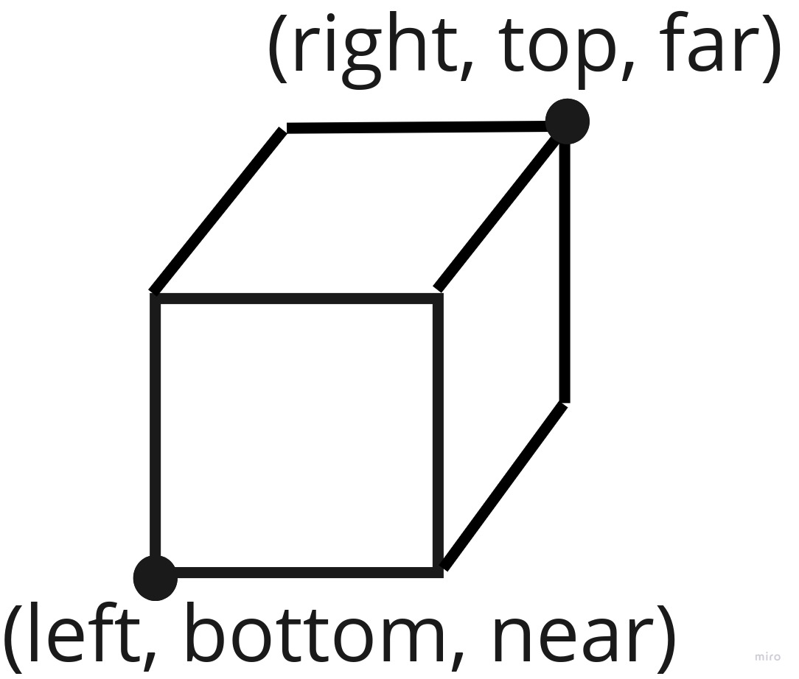

   - Volume canônico: pontos `(-10, -10, -10)` e `(1, 1, 1)`

   - Coordenadas (projeção ­— o pipeline faz o resto)

3. **Funções de callback:**
   - Tratar eventos (entrada)
   - Feito pelo canvas — HTML5
   - Depende do ambiente
4. **Funções de controle:**
   - Para conseguir ser independente de dispositivo
   - Se comunicar com o sistema 
     - Ser capaz de fazer perguntas (width, height, etc)
     - Receber interrupções
     - Inclusive mensagens de erro
   - No caso do WebGL, o navegador é o sistema

### Desenho em 2D

- Área de desenho contida entre `(-1, -1)` e `(1, 1)`
- Plano `z = 0`

#### Máquina de estados

- Cubo de cores


- `cor = (R, G, B, alpha)`
- $\alpha = $ opacidade (oposto da transparência)

### Shaders

- Um programa em WebGL é composto por 2 shaders
  - vertex shader (VS): transforma vértices
  - fragment shader (FS): "pinta" cada pixel
- Os shaders são escritos em **GLSL (OpenGL Shader Language)**
- Precisam ser compilados e depois linkados
- Um programa é executado chamando a `gl.drawArrays` ou `gl.drawElements`

- Para desenhar, é necessário passar dados para a GPU
  1. **Atributos, buffers e arrays de vértices**
     - **buffers:** contém informações sobre posição, cor, normal, etc
       - são acessados sequencialmente, cada vez que ele é acessado ele devolve o próximo elemento disponível
     - **atributos:** definem como os dados devem ser acessados nos buffers
     - **vertex array object (VAO)**: armazena o estado dos atributos e buffers
  2. **Uniformes**
     - variáveis globais que podem ser aplicadas a todos os vértices
     - ao contrário de um atributo que é aplicado a um vértice apenas
  3. **Texturas**
     - vetor de dados que podem ser acesados pelos shaders
     - em geral correspondem a imagens
  4. **Varyings**
     - forma do VS passar dados diretamente para o FS

**Exemplo de Vertex Shader (VS):**

````cpp
#version 300 es //PRECISA SER A 1ª LINHA PARA WebGL 2
// atributo é uma entrada (in) para receber o VS, receberá dados de um buffer
in vec4 aPosition;

void main() {
    // gl_Position é uma variável que deve ser especificada pelo VS
    gl_Position = aPosition;
}
````

**Em JavaScript: crie uma string**

````javascript
// vertex shader
var vertexShaderSrc = `#version 300 es
in vec4 aPosition;
void main() {
    gl_Position = aPosition;
}
`;
````

**Exemplo de Fragment Shader (FS)**

````cpp
#version 300 es
precision highp float; // vc deve definir a precisão do FS -- highp para desktop, mediump para mobile

out vec4 outColor; // crie um vetor de saída para o FS

void main() {
    // escolha uma cor inicial usando RGBA -- como cinza
	outColor = vec4(0.5, 0.5, 0.5, 1.0);
}
````

**Em JS:**

````javascript
var fragmentShaderSrc = `#version 300 es
precision highp float; 
out vec4 outColor;
void main() {
	outColor = vec4(0.5, 0.5, 0.5, 1.0);
}
`;
````

**Função auxiliar para compilação**

````javascript
function compile (gl, type, source) {
    var shader = gl.createShader(type);
    gl.shaderSource(shader, source);
    gl.compileShader(shader);
    var deuCerto = gl.getShaderParameter(shader, gl.COMPILE_STATUS);
    if (deuCerto) {
        return shader;
    }
    // mostra o erro
    console.log(gl.getShaderInfoLog(shader))
    gl.deleteShader(shader);
}
````

**Função auxiliar para linkar os shaders**

````javascript
function link(gl, vertexShader, fragmentShader) {
    var program = gl.createProgram();
    gl.attachShader(program, vertexShader);
    gl.attachShader(program, fragmentShader);
    gl.linkProgram(program);
    var deuCerto = gl.getProgramParameter(program, gl.LINK_STATUS);
    if (deuCerto) {
        return program;
    }
    // mostra o erro
    console.log(gl.getProgramInfoLog(program))
    gl.deleteProgram(program);
}
````

**Compilar e linkar**

````javascript
var vertexShader = compile(gl, gl.VERTEX_SHADER, vertexShaderSrc2);
var fragmentShader = compile(gl, gl.FRAGMENT_SHADER, fragmentShaderSrc2);
var program = link(gl, vertexShader, fragmentShader);
````

**Referência para acessar os atributos do VS:**

````javascript
// pega referências para atributos e uniformes
var aPosition = gl.getAttribLocation(program, 'aPosition');
````

**Buffer para passar os dados ao VS:**

````javascript
// criar um buffer para passar dados para a GPU
var positionBuffer = gl.createBuffer();
gl.bindBuffer(gl.ARRAY_BUFFER, positionBuffer);

// cria o VAO e diga para usar os dados do buffer
var vao = gl.createVertexArray();
gl.bindVertexArray(vao);
gl.enableVertexAttribArray(aPosition);
````

**Defina como ler os dados do buffer**

````javascript
// Diga como tirar os dados
var size = 2; // 2 de cada vez
var type = gl.FLOAT; // tipo = float de 32 bits
var normalize = false; // não normalize os dados
var stride = 0; // 0 = quanto deve avançar a cada iteração para o próximo
var offset = 0; // começa do início
gl.vertexAttribPointer(aPosition, size, type, normalize, stride, offset);
````

**Definir onde exibir no canvas**

````javascript
// Defina onde como converter do volume de recorte para a janela
gl.viewport(0, 0, gl.canvas.width, gl.canvas.height);
````

**Vamos desenhar**

```` javascript
// cor para definir cor de fundo do canvas
gl.clearColor(0.0, 0.0, 1.0, 1.0);
gl.clear(gl.COLOR_BUFFER_BIT);

// Define o programa a ver usado
gl.userProgram(program);

// buffer a ser usado e como usar
gl.bindVertexArray(vao);
````

**Vértices**

````javascript
// vamos definir 3 pontos usando JS array
var positions = [
    0, 0,
    0, 0.5,
    0.7, 0,
];

// WebGL é fortemente tipada. Use Float32Array
// gl.bufferData copia os vértices para a GPU
// STATIC implica que esses dados não devem ser mudados com frequência
gl.bufferData(gl.ARRAY_BUFFER, new Float32Array(positions), gl.STATIC_DRAW)
````

**Finalmente...**

````javascript
var primitiveType = gl.TRIANGLES;
var offset = 0;
var count = 3; // quantas coisas eu vou tirar do array (2 de cada vez)
gl.drawArray(primitiveType, offset, count);
````

- Note que a origem da janela do WebGL é no canto inferior esquerdo

**Utilizando uniformes para modificar cores no Javascript**

````cpp
// no fragment shader...
#version 300 es
precision highp float;
uniform vec4 uColor = vec4(0.5, 0.5, 0.5, 1.0); // define uniforme para cor
out vec4 outColor;

void main() {
	outColor = uColor;
}
````

````javascript
var uColor = gl.getUniformLocation(program, 'uColor'); // pegando uniforme do shader
````

````javascript
gl.uniform4f(uColor, 1.0, 0.0, 1.0, 1.0); // mudando cor
````

**Utilizando uniformes para fazer translações e redimensionamento** 

````cpp
// no vertex shader...
#version 300 es
in vec2 aPosition; // vec2 porque as outras duas coordenadas estarão na resolução
uniform vec2 uResolution; // define uniforme para resolução

void main() {
    vec2 scale = aPosition / uResolution; // normalização entre 0 e 1
    vec2 scale2 = scale1 * 2.0; // mapeando para ficar entre -1 e 1
    vec2 clipSpace = scale2 - 1.0; // translação
    gl_Position = vec4(clipSpace, 0, 1); // preenche o espaço com 0 e 1
}
````

````javascript
var uResolution = gl.getUniformLocation(program, 'uResolution'); // pegando uniforme do shader
````

````javascript
gl.uniform2f(uResolution, gl.canvas.width, gl.canvas.height); // mudando resolução
````

- Código dentro do diretório `shaders`

### Primitivas

````javascript
var primitiveType = gl.POINTS;

var primitiveType = gl.LINES;
var primitiveType = gl.LINE_STRIP;

var primitiveType = gl.TRIANGLES;
var primitiveType = gl.TRIANGLE_FAN;
var primitiveType = gl.TRIANGLE_STRIP;
````

- Existe algum motivo pra não existir uma primitiva retangular?
  - 3 pontos sempre são planares

#### Curvas de Hilbert

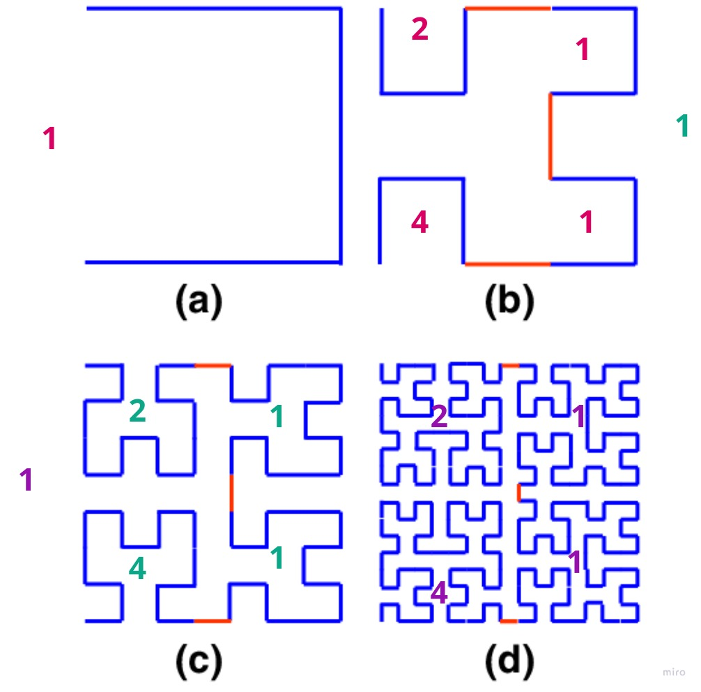

- Rotações de 90º no sentido horário: 1 $\rightarrow$ 2 $\rightarrow$ 3 $\rightarrow$ 4 

## Animação

- Código dentro do diretório `hilbert`

### Displays

- *Refresh rate*: 
  - 30Hz
  - Monitores CRT (tubo de raios catódicos)
  - Imagem entrelaçada (campo par e campo ímpar) -> frequência da rede elétrica: 60Hz
  - VGA: 480 linhas

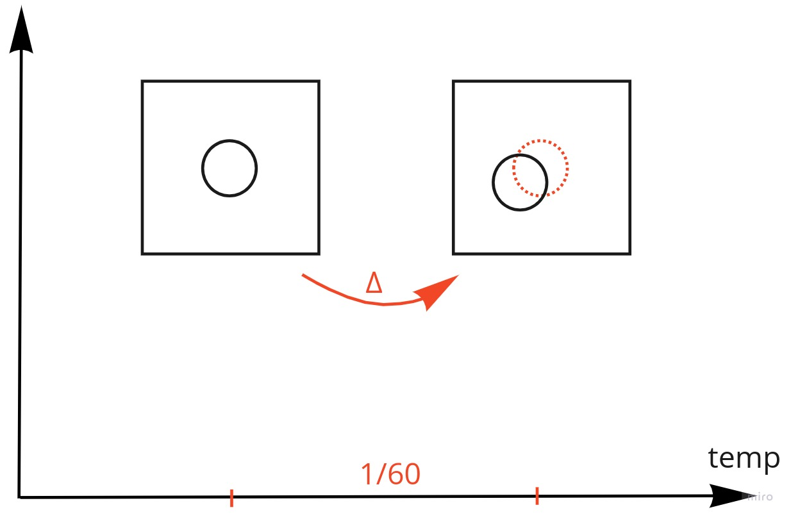

- Informação do **FRAME BUFFER** mandada para o **MONITOR**
- 60Hz é muito rápido: podemos desenhar no Frame Buffer a 20Hz, e o monitor continuará desenhando a 60Hz (repetindo informação)

### Double buffer

- Para evitar que o atraso do desenho apareça

- É automático

- Funções a usar no WebGL:

  - `setInterval(f, deltaT)`: $f$ é a função de renderização, $\Delta t$ é o tempo em *ms*
    - Tenta manter a taxa constante
  - `requestAnimationFrame(f)`: $f$ é a função de renderização
    - Manda desenhar, e quando acabar ele manda outro *request*, mas não deixa a fila crescer
    - Tenta gerar a animação o mais rápido possível 

## Transformações

- Dentro do sistema de coordenadas definido pelo canvas

  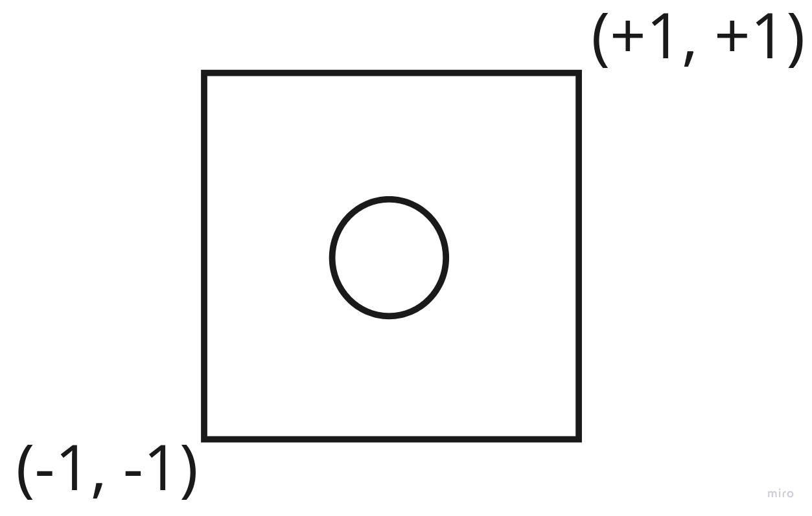

- É interessante que as transformações sejam feitas utilizando o **VAO** (vertex array object), assim o WebGL não precisa gerar várias vezes o canvas todo a cada frame: ele aplica uma transformação linear no objeto
- Bem menos processamento computacional

### Translação

- Pega todos os pontos de um objeto e adiciona um $\Delta x, \Delta y$
- $trans = [\Delta x, \Delta y]$

**Vertex shader:**

````cpp
in vec2 aPosition;
uniform vec2 uTranslation;

void main() {
    vec2 translated = aPosition + uTranslation;
    
}
````

### Rotação


$$
x_{new} = x \cos(\theta) + y \sin(\theta) \\
y_{new} = - x \sin(\theta) + y \cos(\theta)
$$

- Feita com uma multiplicação linear

**Vertex shader:**

````cpp
in vec2 aPosition;
uniform vec2 uRotation; // [sin, cos]

void main() {
    vec2 rotated = vec2(
    	  aPosition[0] * uRotation[1] + aPosition[1] * uRotation[0],
        - aPosition[0] * uRotation[0] + aPosition[1] * uRotation[1]
    )
}
````

### Escala

**Vertex shader:**

````cpp
#version 300 es
 
in vec2 a_position;
uniform vec2 u_scale;
 
void main() {
  // Escala a posição
  vec2 scaledPosition = a_position * u_scale;
}
````

## Geometria e Programação Geométrica

- Geometria de pontos, linhas e objetos planares no espaço 3D
  - Pois a luz se propaga em linha reta: PROJEÇÃO
  - Permite o uso de álgebra linear para transformar objetos
    - Transformações podem ser representadas e manipuladas por matrizes
    - Em particular, um triângulo é sempre planar
- Intersecções geométricas
- Orientação
- Transformação
- Mudança de coordenadas

- **Programação independente de coordenadas**
  - Pensar nos objetos, não nas matrizes e fórmulas
  - ***Tony DeRose*** desenvolveu um método de programação geométrica independente de coordenadas, o que simplifica o raciocínio geométrio
  - Ao invés de matrizes, utilizaremos operadores geométricos de alto nível (esses sim, implementados com matrizes)
  - Infelizmente, ao usar *WebGL*, não conseguimos evitar a presença de matrizes

### Geometria Afim

**Elementos:**

- escalares $\alpha$ — números reais
- pontos $P$ — posição
- vetores livres $\vec{v}$ — direção e magnitude
  - o vetor é "livre" porque não depende de ponto de início e fim: ele depende apenas de direção e magnitude (não de posição)
  - não existe conceito de origem na geometria afim

**Operações básicas:**

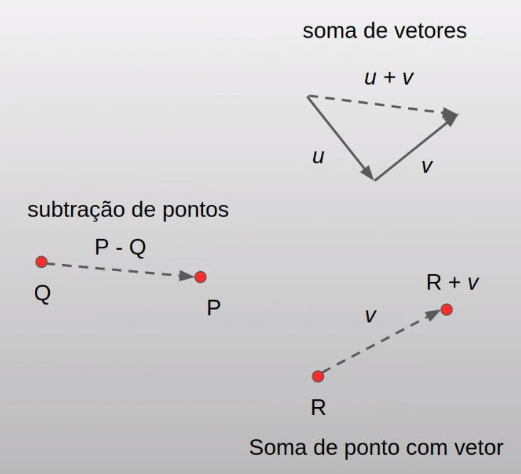

- Multiplicação de escalar por vetor ($\vec{u} = \alpha \vec{v}$ ou $\vec{u} = \vec{v}/\alpha$)
- Soma de vetores ($\vec{w} = \vec{u} + \vec{v}$ ou $\vec{w} = \vec{u} - \vec{v}$ )
- Soma de ponto com vetor ($Q = P + \vec{v}$)
- Subtração entre dois pontos ($P - Q = \vec{v}$, com $\vec{v}$ apontando para $P$)
- **Note que:**
  - Não faz sentido fazer soma de pontos
  - Não faz sentido multiplicar ponto com escalar

**Combinação afim**

- Existe uma combinação particular entre pontos que consideramos válida, denominada uma combinação afim

- Dado dois pontos $Q$ e $P$, qual é seu ponto médio $R$?

  - Ou, genericamente: qual o ponto $R$ que divide $PQ$ nas proporções $\alpha$ e $1-\alpha$, sendo $\alpha \in [0,1]$?

  - Soluções
    $$
    R = P + \alpha (Q-P) \\
    R = (1-\alpha)P + \alpha Q
    $$
     (escalar do vetor $Q-P$)

- **Combinação afim de pontos**

  - Dada uma sequência de pontos $P_1,P_2, \dots, P_n$, uma combinação afim é qualquer soma da forma
    $$
    Q = \alpha_1 P_1 + \alpha_2 P_2 + \dots + \alpha_n P_n,\ (\alpha_1 + \alpha_2 + \dots + \alpha_n = 1)
    $$

  - **Combinação convexa**: todo $\alpha_i$ está no intervalo $[0,1]$

  - Todas as **combinações convexas** de $PQR$?

    

    (Interna ao triângulo $PQR$, incluindo as bordas)

- E qual é a região definida por todas as **combinações afins** de $PQR$?

  Na combinação afim podemos ter $\alpha_i<0$ ou $\alpha_i>1$

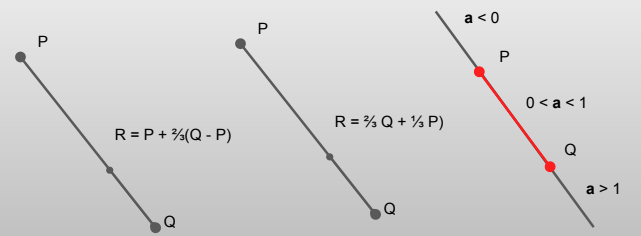

- **Notação:**

  Vamos tomar a liberdade de escrever $R = (P+Q)/2$ para indicar o ponto médio $R$ entre $P$ e $Q$

### Geometria Euclidiana

- Agora inserimos um mecanismo para tratar ângulos e distâncias
- Extensão para produto escalar

**Operações válidas com pontos e vetores:**

- As mesmas da geometria afim
- **Produto escalar $\vec{u} \cdot \vec{v} (<\vec{u} \cdot \vec{v}>)$**
  - Em 2D: $u_0*v_0 + u_1 * v_1$
  - Para nD: $u_1*v_1 + u_2*v_2 + \dots + u_n * v_n$ 
  - **Propriedades:**
    - Positividade ($\vec{u} \cdot \vec{u} \geq 0$ e $\vec{u} \cdot \vec{u} = 0 \iff u = 0$)
    - Simetria ($\vec{u} \cdot \vec{v} = \vec{v} \cdot \vec{u}$)
    - Bilinearidade ($\vec{u} \cdot (\vec{u}+\vec{w}) = \vec{u}\cdot\vec{v} + \vec{u}\cdot\vec{w}$ e $\vec{u}\cdot \alpha \vec{v} = \alpha \vec{u}\cdot\vec{v}$)

**O produto escalar acaba inserindo outras propriedades para o espaço:**

- Comprimento de um vetor ($|\vec{v}| = \sqrt{\vec{v} \cdot \vec{v}}$)

-  Normalização ($\vec{v}' = \vec{v}/ |\vec{v}|$)

- Distância entre dois pontos ($dist(P,Q) = |P-Q|$)

- Ângulo entre dois vetores não nulos
  $$
  \theta = ang(\vec{u}, \vec{v}) = \cos^{-1}(\vec{u}\cdot\vec{v}/(|\vec{u}|\cdot|\vec{v}|) = \cos^{-1}(\vec{u}'\cdot\vec{v}') \\
  \cos\theta = (\vec{u}'\cdot\vec{v}')
  $$

- **Ortogonalidade:** 
  - Dois vetores $\vec{u},\vec{v}$ são ortogonais (perpendiculares) quando $\vec{u} \cdot \vec{v} = 0$
  - **Projeção ortogonal**
    
    - dados um vetor $\vec{u}$ e um vetor não nulo $\vec{v}$, é conveniente decompor $\vec{u}$ como a soma de dois vetores $\vec{u} = \vec{u}_1 + \vec{u}_2$, onde $\vec{u}_1$ é paralelo a $\vec{v}$ e $\vec{u}_2$ é ortogonal a $\vec{v}$
    - $\vec{u}_1 = ((\vec{u}\cdot\vec{v}) / (\vec{v}\cdot\vec{v}) )\vec{v}$ (podemos ignorar $\vec{v} \cdot \vec{v}$ se $|\vec{v}|=1$) 
    - $\vec{u}_2 = \vec{u} - \vec{u}_1$
    - Verifique que $\vec{u}_2$ é ortogonal a $\vec{v}$
    - $\vec{u}_1$ é chamado de **projeção ortogonal** de $\vec{u}$ sobre $\vec{v}$
    
    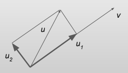

## Objetos em Javascript

- Criação da classe:

````javascript
function Coisa(prop1, prop2, ..., propN) {
    this.prop1 = prop1;
    this.prop2 = prop2;
    ...
    this.propN = propN;
    // outras propriedades  
};
````

- Criação de métodos:

````javascript
function Coisa(prop1, prop2, ..., propN) {
    // atribuição das propriedades aqui
    
    this.metodo = function(pars) {
    	// corpo da função
    };
};
````

- Exemplo: classe retângulo

````javascript
function Rect(l, b, w, h, cor) {
    this.pt = [l, b];
    this.w = w;
    this.cor = cor;
    this.h = h;
    
    this.desenhe = function(pos) {
        pos.push(this.pt[0]);
        pos.push(this.pt[1]);
        pos.push(this.pt[0] + this.w);
        pos.push(this.pt[1]);
        // outros 8 vértices
        // atribui cor
    }
}
````

- Exemplo: criar um conjunto de retângulos

````javascript
var gWidth = .1; // 10% do canvas
var gHeight = .1; // 10% do canvas

function crieRects(n=10, cor) {
    var rects;
    for (var i = 0; i<n; i++) {
        var x = Math.random();
        var y = Math.random();
        
        var r = new Rect(x, y, gWidth, gHeight, cor);
        rects.push(r);
    }
    return rects;
}
````

- Exemplo: desenhar o conjunto de retângulos

````javascript
function desenheTudo(rects, buffer) {
    var n = rects.length;
    for (var i = 0; i < n; i++) {
        rects[i].desenhe(buffer);
    }
}
````

