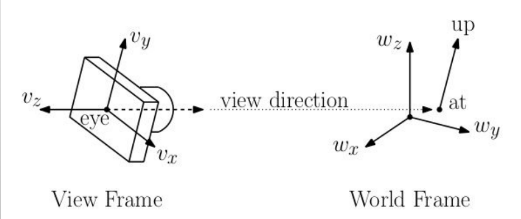

# MAC0420 - Introdução à Computação Gráfica

Oferecimento da disciplina no primeiro semestre de 2021, com o professor Carlos H. Morimoto, no Instituto de Matemática e Estatística da USP.

**Bibliografia:**

1. [Interactive Computer Graphics: a top-down approach with WebGL, Edward Angel, 7th edition](https://www.pearson.com/us/higher-education/product/ANGEL-Interactive-Computer-Graphics-A-Top-Down-Approach-with-Web-GL-7th-Edition/9780133574845.html). Existe uma 8a edição no formato eletrônico.
2. [Introduction to Computer Graphics, David J. Eck, Versão 1.2](http://math.hws.edu/graphicsbook/). Esse material está disponível para download e também ser apreciado online.
3. [Notas de aula de CMSC427 - Computer Graphics](http://www.cs.umd.edu/class/fall2013/cmsc427/) do professor [Dave Mount](http://www.cs.umd.edu/users/mount/).

**Avaliação:**

- Exercícios-programa
- Provinhas

## Introdução

**Objetivo:**

- Gerar imagens de objetos 3D usando um computador

- Fazer o computador ~~desenhar/pintar~~ renderizar

  

**Ferramentas:**

- WebGL

### Um pouco de história

- **Constrained-based drawing:** quadrado - posição e escala
- **Hierarchical model:** objetos e partes X imagens
- **Vector graphics:** descrições X imagens

#### Imagens raster x vetoriais

- Imagem *raster*: matriz de pontos (rasterização é quebrar a imagem em pixel)
- Imagem vetorial: lista de pontos

#### Sistemas gráficos

- monitores antigamente eram vetoriais (vector graphics)

- LCD: sistema gráfico *raster*

- **Um problema**

  - Traçar uma reta entre 2 pontos em um monitor com imagem *raster*
    - Falta de continuidade: problemas de *aliasing* (a reta na verdade se torna conjuntos de blocos, ou seja, pixels) -- problema de quantização
    - Esse problema pode ser resolvido se os pixels deixarem de ser binários e passam a ter níveis de cinza entre 1 byte
  - IDEIA: algoritmo de Bresenham, para linhas
  - Hipótese: $\theta < 45º$

  ```pseudocode
  f(x0, y0) = 0
  próximo ponto deve ser f(x0+1, y0) ou f(x0+1, y0+1)
  quanto vale f(x0+1, y0+1/2)?
  se positivo, próximo é y0+1
  caso contrário é y0
  
  para encontrar o meio: D = f(x0+1, y0+1/2) - f(x0, y0)
  se D < 0:
  	pinte (x0+1, y0)
  	D += A # soma dy
  senão:
  	pinte (x0+1, y0+1)
  	D += A + B # soma dy - dx
  ```

  O algoritmo só precisa de soma, subtração e *shift* (divisão por 2) -- é um algoritmo muito eficiente

- Sistema gráfico *raster* com processador gráfico

## O domínio da computação gráfica


### Elementos gráficos

- **pixel** = *picture element*, é a unidade na qual trabalharemos
  - pode ter valor binário (0 | 1), cinza (1 byte, ou seja, [0,255]), ou cor
- **desenho** = formas geométricas, polilinhas -> **vetoriza**
  - linhas abertas 
  - linhas fechadas (polígono) --o conceito de dentro e fora
  - linhas podem se cruzar ou não
- **pintura** = nasce do polígono: pintar  que está dentro, ou pintar o que está fora, ou a borda -> **rasteriza**
  - pintar é modificar propriedades de elementos gráficos

### Informações da cena


### A Câmera

- "Plano de imagem" -- a imagem está na câmera


- Além da posição e da orientação, o **zoom** definido na câmera também modifica a imagem

- O **FOV** é inversamente proporcional ao comprimento focal e ao zoom

### A Imagem

- **W**idth: largura da imagem
- **H**eight: altura da imagem
- **W/H**: *aspect ratio*

- Pixel: profundidade
  - Número de bits
    - 1 bit - binária, 
    - 8 bits - cinza, 
    - 24 bits - RGB, 
    - 32 bits - RGBA  (canal alfa para opacidade ou profundidade)

### Cor

- Comprimento de onda (eletromagnética) ou partícula (fóton) 
- Percepção - constância de cor

* *Halftoning* - impressoras


## Javascript Canvas

- Callbacks (eventos)
- Máquina de estados
- Código dentro do diretório `javascript_examples`

## Fractais

- Qual o perímetro da costa da Escócia?
- Dimensão fractal

  - 1 dimensão: linha
    - 1 $\epsilon$-bola
    - Quantas bolas de tamanho $\frac{\epsilon}{2}$ são necessárias para cobrir o mesmo objeto? $2$
    - $\frac{1}{a} \implies$ vou precisar de $a$ vezes mais bolas
  - 2 dimensão: plano
    - 1 bola de tamanho $\epsilon$
    - Quantas bolas de tamanho $\frac{\epsilon}{2}$ são necessárias para cobrir o mesmo objeto? $4$
    - $\frac{1}{a} \implies$ vou precisar de $a^2$ vezes mais bolas

  - Triângulo de Sierpinski
    - $N(A, \epsilon) \rightarrow $ menor número de $\epsilon$-bolas para cobrir $A$ 
    - $\frac{1}{2}^d \approx 1.58...$ 
- Funções iteradas

  - $z \rightarrow z^2$
- Números complexos
- Atratores
- Conjuntos de Julia: $z \rightarrow z^2 + c$

## WebGL e o Pipeline Gráfico

### No canvas...

- Como funciona uma **API 2D** (Application Programming Interface)
  - canvas do HTML5 — usa um modelo *pen-plotter* (controle de uma "caneta" por meio de deslocamento nos eixos $(x,y)$)
  - `moveTo(x0,y0)` e `lineTo(x1,y1)`

### API 3D

#### Processo de formação de imagem


#### Hardware


- Framerate $\neq$ framebuffer

### Raytracing 

- **Ray casting:** projetar cada pixel na imagem e checar se ele incide no objeto, se sim, pegar a cor (dada pela função da superfície e sua interação com a fonte de luz)
- **Ray tracing:** não é só uma função da superfície e sua interação com a fonte de luz — pode haver espelhos (reflexão), objetos fazendo sombra em outros, refração
- Computacionalmente muito caro

### Pipeline gráfico

- Primitivas geométricas: vértices, linhas e triângulos
- Calcular interação das primitivas geométricas com cores, superfícies
- Projetar objetos matemáticos (que já conhecemos) na imagem

- Geometria (linhas e vértices) $\rightarrow$ RASTER (pixels)
  - Linha de produção: paralelização


- **Processador de vértices**
- **Clipping e montagem de primitivas**: além do plano delimitado pelo *field of view* ($\approx 90º$), o cone da *clipping window* é truncado em "perto" e "longe"  
- **Rasterização**
- **Processador de fragmentos**

### OPENGL - Open Graphics Library

#### Histórico

- Silicon Graphics (SGI) — IRIS — **IRIS GL** (específico para uma arquitetura)

- **OpenGL 1.0** (1992) — *immediate-mode graphics* 
  - CPU gera os vértices
  - Problema $\rightarrow$ não tinha memória
- **OpenGL 2.0** (2004) — OpenGL Shading Language (GLSL)
  - Permite criar ***shaders*** $\rightarrow$ roda na GPU
  - *retained-mode graphics*
- **OpenGL 3.0** (2008) — não dá mais suporte ao *immediate-mode*

- Dispositivos móveis — **OpenGL ES** (*Embedded Systems*)
  - OGL ES 1.0 (2003) — OpenGL 1.3
  - OGL ES 2.0 (2007) — OpenGL 2.0
  - OGL ES 3.0 (2012) — OpenGL 3.0
- **WebGL 2.0** — OGL ES 3.0
  - suporta *shaders*
- Outras libs ainda usadas: **Direct X**

#### Medidas de desempenho

- **Triângulos por segundo** — geometria (front-end)
  - Capacidade de renderização
  - Quantas primitivas geométricas são desenhadas por medida de tempo
- **Movimentação de dados** (back-end)
  - Through-put
  - Capacidade da placa de mandar informação para o frame buffer

- Frame buffer com **float** — HDR
  - Processamento mais detalhado

#### Exemplo

Função em OpenGL:

- Immediate mode

````pseudocode
function desenhe_Julia()
	init
	for cada ponto:
		calcule e
		pinte o ponto # display
    clean
````

- Retained mode

````pseudocode
function desenhe_Julia()
	init
	for cada ponto:
		calcule e
		salve o ponto em Q  # matriz salva na placa gráfica
	display Q
    clean
````

Mas ainda não conseguimos mudar o `Q`...

- Shaders

````pseudocode
function desenhe_Julia()
	init
	for cada ponto:
		calcule e
		salve o ponto em Q
	enviar Q # shader
	display Q 
    clean
````

O shader roda na GPU

### API 3D

- Para desenhar em 3D: queremos escolher o **sistema de coordenadas (SC)**, independente do dispositivo
- **Em 2D** (vimos no canvas)...
  - Mapeamento mundo $\rightarrow$ dispositivo
  - Manter aspect ratio X distorcer — depende da aplicação

**O que uma API 3D deve oferecer?**

1. **Funções de desenho**:

   - Na forma de primitivas geométricas
   - **Vértice** (consiste de um ponto e outros atributos/propriedades: cor, textura, transparência, normal, etc) $\neq$ ponto (posição no espaço)
     - **2 vértices podem representar**:
       - 2 vértices
       - segmento de reta
       - retângulo
       - circunferência (centro, ponto $\in$ borda)
     - **3 vértices:**
       - triângulo (o polígono mais simples)
       - circunferência (pontos $\in$ borda)
   - **Linhas**
   - **Triângulos**
   - Ideia: decompor objetos 3D em triângulos
   - Associar propriedades às primitivas 

2. **Funções de definição de câmera:**

   **Clipping volume**

   - Janela de clipping

   - Definido por um cubo: pontos `(left, bottom, near)` e `(right, top, far)`

     

   - Volume canônico: pontos `(-10, -10, -10)` e `(1, 1, 1)`

   - Coordenadas (projeção ­— o pipeline faz o resto)

3. **Funções de callback:**

   - Tratar eventos (entrada)
   - Feito pelo canvas — HTML5
   - Depende do ambiente

4. **Funções de controle:**

   - Para conseguir ser independente de dispositivo
   - Se comunicar com o sistema 
     - Ser capaz de fazer perguntas (width, height, etc)
     - Receber interrupções
     - Inclusive mensagens de erro
   - No caso do WebGL, o navegador é o sistema

### Desenho em 2D

- Área de desenho contida entre `(-1, -1)` e `(1, 1)`
- Plano `z = 0`

#### Máquina de estados

- Cubo de cores


- `cor = (R, G, B, alpha)`
- $\alpha = $ opacidade (oposto da transparência)

### Shaders

- Um programa em WebGL é composto por 2 shaders
  - vertex shader (VS): transforma vértices
  - fragment shader (FS): "pinta" cada pixel
- Os shaders são escritos em **GLSL (OpenGL Shader Language)**
- Precisam ser compilados e depois linkados
- Um programa é executado chamando a `gl.drawArrays` ou `gl.drawElements`

- Para desenhar, é necessário passar dados para a GPU
  1. **Atributos, buffers e arrays de vértices**
     - **buffers:** contém informações sobre posição, cor, normal, etc
       - são acessados sequencialmente, cada vez que ele é acessado ele devolve o próximo elemento disponível
     - **atributos:** definem como os dados devem ser acessados nos buffers
     - **vertex array object (VAO)**: armazena o estado dos atributos e buffers
  2. **Uniformes**
     - variáveis globais que podem ser aplicadas a todos os vértices
     - ao contrário de um atributo que é aplicado a um vértice apenas
  3. **Texturas**
     - vetor de dados que podem ser acesados pelos shaders
     - em geral correspondem a imagens
  4. **Varyings**
     - forma do VS passar dados diretamente para o FS

**Exemplo de Vertex Shader (VS):**

````cpp
#version 300 es //PRECISA SER A 1ª LINHA PARA WebGL 2
// atributo é uma entrada (in) para receber o VS, receberá dados de um buffer
in vec4 aPosition;

void main() {
    // gl_Position é uma variável que deve ser especificada pelo VS
    gl_Position = aPosition;
}
````

**Em JavaScript: crie uma string**

````javascript
// vertex shader
var vertexShaderSrc = `#version 300 es
in vec4 aPosition;
void main() {
    gl_Position = aPosition;
}
`;
````

**Exemplo de Fragment Shader (FS)**

````cpp
#version 300 es
precision highp float; // vc deve definir a precisão do FS -- highp para desktop, mediump para mobile

out vec4 outColor; // crie um vetor de saída para o FS

void main() {
    // escolha uma cor inicial usando RGBA -- como cinza
	outColor = vec4(0.5, 0.5, 0.5, 1.0);
}
````

**Em JS:**

````javascript
var fragmentShaderSrc = `#version 300 es
precision highp float; 
out vec4 outColor;
void main() {
	outColor = vec4(0.5, 0.5, 0.5, 1.0);
}
`;
````

**Função auxiliar para compilação**

````javascript
function compile (gl, type, source) {
    var shader = gl.createShader(type);
    gl.shaderSource(shader, source);
    gl.compileShader(shader);
    var deuCerto = gl.getShaderParameter(shader, gl.COMPILE_STATUS);
    if (deuCerto) {
        return shader;
    }
    // mostra o erro
    console.log(gl.getShaderInfoLog(shader))
    gl.deleteShader(shader);
}
````

**Função auxiliar para linkar os shaders**

````javascript
function link(gl, vertexShader, fragmentShader) {
    var program = gl.createProgram();
    gl.attachShader(program, vertexShader);
    gl.attachShader(program, fragmentShader);
    gl.linkProgram(program);
    var deuCerto = gl.getProgramParameter(program, gl.LINK_STATUS);
    if (deuCerto) {
        return program;
    }
    // mostra o erro
    console.log(gl.getProgramInfoLog(program))
    gl.deleteProgram(program);
}
````

**Compilar e linkar**

````javascript
var vertexShader = compile(gl, gl.VERTEX_SHADER, vertexShaderSrc2);
var fragmentShader = compile(gl, gl.FRAGMENT_SHADER, fragmentShaderSrc2);
var program = link(gl, vertexShader, fragmentShader);
````

**Referência para acessar os atributos do VS:**

````javascript
// pega referências para atributos e uniformes
var aPosition = gl.getAttribLocation(program, 'aPosition');
````

**Buffer para passar os dados ao VS:**

````javascript
// criar um buffer para passar dados para a GPU
var positionBuffer = gl.createBuffer();
gl.bindBuffer(gl.ARRAY_BUFFER, positionBuffer);

// cria o VAO e diga para usar os dados do buffer
var vao = gl.createVertexArray();
gl.bindVertexArray(vao);
gl.enableVertexAttribArray(aPosition);
````

**Defina como ler os dados do buffer**

````javascript
// Diga como tirar os dados
var size = 2; // 2 de cada vez
var type = gl.FLOAT; // tipo = float de 32 bits
var normalize = false; // não normalize os dados
var stride = 0; // 0 = quanto deve avançar a cada iteração para o próximo
var offset = 0; // começa do início
gl.vertexAttribPointer(aPosition, size, type, normalize, stride, offset);
````

**Definir onde exibir no canvas**

````javascript
// Defina onde como converter do volume de recorte para a janela
gl.viewport(0, 0, gl.canvas.width, gl.canvas.height);
````

**Vamos desenhar**

```` javascript
// cor para definir cor de fundo do canvas
gl.clearColor(0.0, 0.0, 1.0, 1.0);
gl.clear(gl.COLOR_BUFFER_BIT);

// Define o programa a ver usado
gl.userProgram(program);

// buffer a ser usado e como usar
gl.bindVertexArray(vao);
````

**Vértices**

````javascript
// vamos definir 3 pontos usando JS array
var positions = [
    0, 0,
    0, 0.5,
    0.7, 0,
];

// WebGL é fortemente tipada. Use Float32Array
// gl.bufferData copia os vértices para a GPU
// STATIC implica que esses dados não devem ser mudados com frequência
gl.bufferData(gl.ARRAY_BUFFER, new Float32Array(positions), gl.STATIC_DRAW)
````

**Finalmente...**

````javascript
var primitiveType = gl.TRIANGLES;
var offset = 0;
var count = 3; // quantas coisas eu vou tirar do array (2 de cada vez)
gl.drawArray(primitiveType, offset, count);
````

- Note que a origem da janela do WebGL é no canto inferior esquerdo

**Utilizando uniformes para modificar cores no Javascript**

````cpp
// no fragment shader...
#version 300 es
precision highp float;
uniform vec4 uColor = vec4(0.5, 0.5, 0.5, 1.0); // define uniforme para cor
out vec4 outColor;

void main() {
	outColor = uColor;
}
````

````javascript
var uColor = gl.getUniformLocation(program, 'uColor'); // pegando uniforme do shader
````

````javascript
gl.uniform4f(uColor, 1.0, 0.0, 1.0, 1.0); // mudando cor
````

**Utilizando uniformes para fazer translações e redimensionamento** 

````cpp
// no vertex shader...
#version 300 es
in vec2 aPosition; // vec2 porque as outras duas coordenadas estarão na resolução
uniform vec2 uResolution; // define uniforme para resolução

void main() {
    vec2 scale = aPosition / uResolution; // normalização entre 0 e 1
    vec2 scale2 = scale1 * 2.0; // mapeando para ficar entre -1 e 1
    vec2 clipSpace = scale2 - 1.0; // translação
    gl_Position = vec4(clipSpace, 0, 1); // preenche o espaço com 0 e 1
}
````

````javascript
var uResolution = gl.getUniformLocation(program, 'uResolution'); // pegando uniforme do shader
````

````javascript
gl.uniform2f(uResolution, gl.canvas.width, gl.canvas.height); // mudando resolução
````

- Código dentro do diretório `shaders`

### Primitivas

````javascript
var primitiveType = gl.POINTS;

var primitiveType = gl.LINES;
var primitiveType = gl.LINE_STRIP;

var primitiveType = gl.TRIANGLES;
var primitiveType = gl.TRIANGLE_FAN;
var primitiveType = gl.TRIANGLE_STRIP;
````

- Existe algum motivo pra não existir uma primitiva retangular?
  - 3 pontos sempre são planares

#### Curvas de Hilbert


- Rotações de 90º no sentido horário: 1 $\rightarrow$ 2 $\rightarrow$ 3 $\rightarrow$ 4 

## Animação

- Código dentro do diretório `hilbert`

### Displays

- *Refresh rate*: 
  - 30Hz
  - Monitores CRT (tubo de raios catódicos)
  - Imagem entrelaçada (campo par e campo ímpar) -> frequência da rede elétrica: 60Hz
  - VGA: 480 linhas


- Informação do **FRAME BUFFER** mandada para o **MONITOR**
- 60Hz é muito rápido: podemos desenhar no Frame Buffer a 20Hz, e o monitor continuará desenhando a 60Hz (repetindo informação)

### Double buffer

- Para evitar que o atraso do desenho apareça

- É automático

- Funções a usar no WebGL:

  - `setInterval(f, deltaT)`: $f$ é a função de renderização, $\Delta t$ é o tempo em *ms*
    - Tenta manter a taxa constante
  - `requestAnimationFrame(f)`: $f$ é a função de renderização
    - Manda desenhar, e quando acabar ele manda outro *request*, mas não deixa a fila crescer
    - Tenta gerar a animação o mais rápido possível 

## Transformações

- Dentro do sistema de coordenadas definido pelo canvas

  

- É interessante que as transformações sejam feitas utilizando o **VAO** (vertex array object), assim o WebGL não precisa gerar várias vezes o canvas todo a cada frame: ele aplica uma transformação linear no objeto

- Bem menos processamento computacional

### Translação

- Pega todos os pontos de um objeto e adiciona um $\Delta x, \Delta y$
- $trans = [\Delta x, \Delta y]$

**Vertex shader:**

````cpp
in vec2 aPosition;
uniform vec2 uTranslation;

void main() {
    vec2 translated = aPosition + uTranslation;
    
}
````

### Rotação


$$
x_{new} = x \cos(\theta) + y \sin(\theta) \\
y_{new} = - x \sin(\theta) + y \cos(\theta)
$$

- Feita com uma multiplicação linear

**Vertex shader:**

````cpp
in vec2 aPosition;
uniform vec2 uRotation; // [sin, cos]

void main() {
    vec2 rotated = vec2(
    	  aPosition[0] * uRotation[1] + aPosition[1] * uRotation[0],
        - aPosition[0] * uRotation[0] + aPosition[1] * uRotation[1]
    )
}
````

### Escala

**Vertex shader:**

````cpp
#version 300 es
 
in vec2 a_position;
uniform vec2 u_scale;
 
void main() {
  // Escala a posição
  vec2 scaledPosition = a_position * u_scale;
}
````

## Geometria e Programação Geométrica

- Geometria de pontos, linhas e objetos planares no espaço 3D
  - Pois a luz se propaga em linha reta: PROJEÇÃO
  - Permite o uso de álgebra linear para transformar objetos
    - Transformações podem ser representadas e manipuladas por matrizes
    - Em particular, um triângulo é sempre planar
- Intersecções geométricas
- Orientação
- Transformação
- Mudança de coordenadas

- **Programação independente de coordenadas**
  - Pensar nos objetos, não nas matrizes e fórmulas
  - ***Tony DeRose*** desenvolveu um método de programação geométrica independente de coordenadas, o que simplifica o raciocínio geométrio
  - Ao invés de matrizes, utilizaremos operadores geométricos de alto nível (esses sim, implementados com matrizes)
  - Infelizmente, ao usar *WebGL*, não conseguimos evitar a presença de matrizes

### Geometria Afim

**Elementos:**

- escalares $\alpha$ — números reais
- pontos $P$ — posição
- vetores livres $\vec{v}$ — direção e magnitude
  - o vetor é "livre" porque não depende de ponto de início e fim: ele depende apenas de direção e magnitude (não de posição)
  - não existe conceito de origem na geometria afim

**Operações básicas:**


- Multiplicação de escalar por vetor ($\vec{u} = \alpha \vec{v}$ ou $\vec{u} = \vec{v}/\alpha$)
- Soma de vetores ($\vec{w} = \vec{u} + \vec{v}$ ou $\vec{w} = \vec{u} - \vec{v}$ )
- Soma de ponto com vetor ($Q = P + \vec{v}$)
- Subtração entre dois pontos ($P - Q = \vec{v}$, com $\vec{v}$ apontando para $P$)
- **Note que:**
  - Não faz sentido fazer soma de pontos
  - Não faz sentido multiplicar ponto com escalar

**Combinação afim**

- Existe uma combinação particular entre pontos que consideramos válida, denominada uma combinação afim

- Dado dois pontos $Q$ e $P$, qual é seu ponto médio $R$?

  - Ou, genericamente: qual o ponto $R$ que divide $PQ$ nas proporções $\alpha$ e $1-\alpha$, sendo $\alpha \in [0,1]$?

  - Soluções
    $$
    R = P + \alpha (Q-P) \\
    R = (1-\alpha)P + \alpha Q
    $$
     (escalar do vetor $Q-P$)

- **Combinação afim de pontos**

  - Dada uma sequência de pontos $P_1,P_2, \dots, P_n$, uma combinação afim é qualquer soma da forma
    $$
    Q = \alpha_1 P_1 + \alpha_2 P_2 + \dots + \alpha_n P_n,\ (\alpha_1 + \alpha_2 + \dots + \alpha_n = 1)
    $$

  - **Combinação convexa**: todo $\alpha_i$ está no intervalo $[0,1]$

  - Todas as **combinações convexas** de $PQR$?

    

    (Interna ao triângulo $PQR$, incluindo as bordas)

- E qual é a região definida por todas as **combinações afins** de $PQR$?

  Na combinação afim podemos ter $\alpha_i<0$ ou $\alpha_i>1$


- **Notação:**

  Vamos tomar a liberdade de escrever $R = (P+Q)/2$ para indicar o ponto médio $R$ entre $P$ e $Q$

### Geometria Euclidiana

- Agora inserimos um mecanismo para tratar ângulos e distâncias
- Extensão para produto escalar

**Operações válidas com pontos e vetores:**

- As mesmas da geometria afim
- **Produto escalar $\vec{u} \cdot \vec{v} (<\vec{u} \cdot \vec{v}>)$**
  - Em 2D: $u_0*v_0 + u_1 * v_1$
  - Para nD: $u_1*v_1 + u_2*v_2 + \dots + u_n * v_n$ 
  - **Propriedades:**
    - Positividade ($\vec{u} \cdot \vec{u} \geq 0$ e $\vec{u} \cdot \vec{u} = 0 \iff u = 0$)
    - Simetria ($\vec{u} \cdot \vec{v} = \vec{v} \cdot \vec{u}$)
    - Bilinearidade ($\vec{u} \cdot (\vec{u}+\vec{w}) = \vec{u}\cdot\vec{v} + \vec{u}\cdot\vec{w}$ e $\vec{u}\cdot \alpha \vec{v} = \alpha \vec{u}\cdot\vec{v}$)

**O produto escalar acaba inserindo outras propriedades para o espaço:**

- Comprimento de um vetor ($|\vec{v}| = \sqrt{\vec{v} \cdot \vec{v}}$)

- Normalização ($\vec{v}' = \vec{v}/ |\vec{v}|$)

- Distância entre dois pontos ($dist(P,Q) = |P-Q|$)

- Ângulo entre dois vetores não nulos
  $$
  \theta = ang(\vec{u}, \vec{v}) = \cos^{-1}(\vec{u}\cdot\vec{v}/(|\vec{u}|\cdot|\vec{v}|) = \cos^{-1}(\vec{u}'\cdot\vec{v}') \\
  \cos\theta = (\vec{u}'\cdot\vec{v}')
  $$

- **Ortogonalidade:** 

  - Dois vetores $\vec{u},\vec{v}$ são ortogonais (perpendiculares) quando $\vec{u} \cdot \vec{v} = 0$

  - **Projeção ortogonal**

    - dados um vetor $\vec{u}$ e um vetor não nulo $\vec{v}$, é conveniente decompor $\vec{u}$ como a soma de dois vetores $\vec{u} = \vec{u}_1 + \vec{u}_2$, onde $\vec{u}_1$ é paralelo a $\vec{v}$ e $\vec{u}_2$ é ortogonal a $\vec{v}$
    - $\vec{u}_1 = ((\vec{u}\cdot\vec{v}) / (\vec{v}\cdot\vec{v}) )\vec{v}$ (podemos ignorar $\vec{v} \cdot \vec{v}$ se $|\vec{v}|=1$) 
    - $\vec{u}_2 = \vec{u} - \vec{u}_1$
    - Verifique que $\vec{u}_2$ é ortogonal a $\vec{v}$
    - $\vec{u}_1$ é chamado de **projeção ortogonal** de $\vec{u}$ sobre $\vec{v}$

    

## Objetos em Javascript

- Criação da classe:

````javascript
function Coisa(prop1, prop2, ..., propN) {
    this.prop1 = prop1;
    this.prop2 = prop2;
    ...
    this.propN = propN;
    // outras propriedades  
};
````

- Criação de métodos:

````javascript
function Coisa(prop1, prop2, ..., propN) {
    // atribuição das propriedades aqui
    
    this.metodo = function(pars) {
    	// corpo da função
    };
};
````

- Exemplo: classe retângulo

````javascript
function Rect(l, b, w, h, cor) {
    this.pt = [l, b];
    this.w = w;
    this.cor = cor;
    this.h = h;
    
    this.desenhe = function(pos) {
        pos.push(this.pt[0]);
        pos.push(this.pt[1]);
        pos.push(this.pt[0] + this.w);
        pos.push(this.pt[1]);
        // outros 8 vértices
        // atribui cor
    }
}
````

- Exemplo: criar um conjunto de retângulos

````javascript
var gWidth = .1; // 10% do canvas
var gHeight = .1; // 10% do canvas

function crieRects(n=10, cor) {
    var rects;
    for (var i = 0; i<n; i++) {
        var x = Math.random();
        var y = Math.random();
        
        var r = new Rect(x, y, gWidth, gHeight, cor);
        rects.push(r);
    }
    return rects;
}
````

- Exemplo: desenhar o conjunto de retângulos

````javascript
function desenheTudo(rects, buffer) {
    var n = rects.length;
    for (var i = 0; i < n; i++) {
        rects[i].desenhe(buffer);
    }
}
````

## *Frame* de coordenadas e coordenadas homogêneas

- Como representar pontos e vetores com geometria afim?

### Da álgebra linear...

- Combinação linear de vetores

- Base vetorial em nD: n vetores linearmente independentes

- Em 3D, devemos usar 3 vetores linearmente independentes $e_x, e_y, e_z$

- Qualquer vetor $v$ pode ser escrito como: $v = a_0 e_x + a_1 e_y + a_2 e_z$

- A base mais comum utiliza vetores unitários ortogonais entre si :
  $$
  e_x = (1, 0, 0)^T, e_y = (0, 1, 0)^T, e_z = (0, 0, 1)^T 
  $$
  (base ortonormal)

- Os vetores da base são chamados de vetores de coordenadas, e a triple $(a_0, a_1, a_2)$ define a coordenada cartesiana do vetor $v$

- Porém, 3 vetores apenas não são suficientes para determinar a posição de um ponto

  - É necessário definirmos uma **origem** $O$ para o sistema de coordenadas

### *Frame* de coordenadas

- Em um espaço afim, precisamos de uma forma de representar pontos além de vetores

- Um frame de coordendas em um espaço afim d-dimensional será definido por um conjunto de $d$ vetores linearmente independentes e um ponto de origem $\mathcal{O}$

- Assim, um ponto $P$ em 3D pode ser representado assim:Generalização:
  $$
  P = a_0u_0 + a_1u_1 + a_2u_2 + \mathcal{O}
  $$

### Coordenadas homogêneas

- Representar pontos e vetores como uma **lista de escalares**
- Para um espaço d-dimensional, utilizaremos vetores de comprimento d+1
  - pontos tem a última coordenada = 1
  - vetores tem a última coordenada = 0
- Esse tipo de representação é denominado **coordenadas homogêneas** de um ponto ou vetor relativo a um frame $F$

### Axioma de coordenada

Para cada ponto $P$ no espaço afim temos:

- $0 * P =$ vetor nulo 0
- $1 * P = $ P

**Atenção!** O termo vetor pode ser usado como

- vetor livre 
- vetor de coordenadas

### Propriedades das coordenadas homogêneas

A escolha de 1 e 0 para ponto e vetor **não é arbitrária**:

- $v = P-Q$: a última coordenada se cancela
- seja $U$ e $V$ pontos ou vetores, após várias operações da forma $U-V$, $U+V$ ou $aU$:
  - se a última coordenada = 0: vetor
  - se a última coordenada = 1: ponto
  - caso contrário, não é uma operação afim válida
- Isso permite grande flexibilidade, como combinações do tipo:
  - centroide = $(P+Q+R)/3$ (centro de massa)
  - agora podemos fazer soma de pontos — e dar significados a eles

### Sistemas de coordenadas alternativos

**Objetivos conflitantes:**

1. pontos e vetores representados com respeito a algum sistema **universal** de coordenadas, permite trabalhar com pontos e vetores simplesmente modificando suas coordenadas
2. representar pontos de acordo com um sistema de coordenadas **local**

**Convenção:** sistema de coordenadas universal

- *Frame* padrão fixo, ortonormal: $e_0, e_1, e_1, O$

### Mudança de coordenadas

**Exemplo:**


$$
P[F] = \begin{bmatrix} 3 \\ 2 \\ 1 \end{bmatrix},\ 
P[G] = \begin{bmatrix} 1 \\ 2 \\ 1 \end{bmatrix}
$$
Transformação $M$

Sabemos que $P = \beta_0 G e_0 + \beta_1 G e_1 + \beta_2 G e_2$

Queremos $P = \beta_0 G e_0[F] + \beta_1 G e_1[F] + \beta_2 G e_2[F]$:
$$
G e_0[F] = (-2, -1, 0)^T = (g_{00}, g_{01}, 0)^T \\
G e_1[F] = (0, 1, 0)^T = (g_{10}, g_{11}, 0)^T \\
G e_2[F] = (5, 1, 1)^T = (g_{20}, g_{21}, 1)^T
$$
Portanto...
$$
P = \beta_0 \begin{bmatrix} -2 \\ -1 \\ 0 \end{bmatrix} + \beta_1 \begin{bmatrix} 0 \\ 1 \\ 0 \end{bmatrix} + \beta_2 \begin{bmatrix} 5 \\ 1 \\ 1 \end{bmatrix}
$$
Do sistema linear, temos:
$$
\underbrace{\begin{bmatrix} -2 & 0 & 5\\ -1 & 1 & 1 \\ 0 & 0 & 1 \end{bmatrix}}_{M}
\underbrace{\begin{bmatrix} \beta_0 \\ \beta_1 \\ \beta_2 \end{bmatrix}}_{P[G]}
$$
**Generalização:**
$$
M = (G e_0 [F] | G e_1 [F] | G O [F]) \\
P[F] = M P[G] \\
P[G] = M^{-1} P[F] 
$$

- $M$ é sempre inversível

## Desenhando múltiplos objetos

**Como desenhar um objeto em WebGL?**

1. criar os *shaders*: *vertex* e *fragment*
2. criar os vértices do objeto
   - VAO: mantém a estrutura
3. definir os *uniform*'s
4. desenhar (rodar a estrutura no *pipeline*)

### Como desenhar múltiplos objetos?

Rodar o *pipeline* para cada objeto

Vamos assumir que:

- a geometria de cada objeto não se altera
- a cor de cada objeto pode ser definida por um *uniform*

Então, para cada objeto `obj`:

- `gl.useProgram(obj.program)`
- `gl.bindVertexArray(obj.vao)`
- `gl.uniform4fv(obj.uCor, [1.0, 0.5, 0.0, 1.0])`
- setar outros *uniform*'s como a transformação

### Como animar múltiplos objetos?

É necessário simular alguma interação entre objetos antes de desenhá-los

Exemplo de bola que destrói blocos:

- atualize a posição da bola
- veja se a bola bateu em um bloco
  - atualize (remova) o bloco — a geometria muda, então vai ser necessário redefinir os vértices renderizados
  - atualize a bola

Depois desenhamos. Para cada objeto `obj`:

- `gl.useProgram(obj.program)`
- `gl.bindVertexArray(obj.vao)`
- `gl.uniform4fv(obj.uCor, [1.0, 0.5, 0.0, 1.0])`
- setar outros *uniform*'s como a transformação

## Transformações afins

É uma classe de transformações que inclui:

- rotação
- translação
- escala (uniforme e não uniforme)
- reflexão
- cisalhamento

Propriedades:

- todas as transformações afins $T$ preservam combinações afins entre pontos
  $$
  R = (1-a) P + a Q \implies T(R) = (1-a) T(P) + a T(Q)
  $$

### Representação matricial

As combinações afins são preservadas, portanto:
$$
R = a_0 F.e_0 + a_1 F.e_1 + a_2 F.O \implies T(R) = a_0 T(F.e_0) + a_1 T(F.e_1) + a_2 T(F.O)
$$
Assim, se $R$ é um ponto ou vetor no frame $F$ e sabemos a transformação dos elementos do frame, então sabemos qual a transformação de $R$, ou (em 2D):
$$
T(R)[F] = (T(F.e_0)[F] | T(F.e_1)[F] | T(F.O)[F]) (a_0, a_1, a_2)^T
$$
ou seja, aplicar uma transformação afim a um ponto/vetor equivale a multiplicar suas coordenadas por uma matriz, formada pela transformação dos elementos do frame

### Translação

- translação por um vetor $\vec{v}$ mapeia qualquer ponto $P$ para $P + \vec{v}$
- vetores (livres) não são afetados por translação

$$
T(\vec{v}) =
\begin{bmatrix}
1 & 0 & 0 & dx \\
0 & 1 & 0 & dy \\
0 & 0 & 1 & dz \\
0 & 0 & 0 & 1
\end{bmatrix}
$$

### Mudança de escala

- mudança de escala uniforme é feita com relação a um ponto
  - considere a origem do frame padrão
- dado um escalar $b$, esta transformação mapeia um objeto (ponto ou vetor) de coordenadas $(a_0, a_1, a_2, a_3)^T$ para $(b a_0, b a_1, b a_2, a_3)^T$
- para mudança não uniforme: $(b_0 a_0, b_1 a_1, b_2 a_2, a_3)^T$

$$
\begin{bmatrix}
S_x = 1 & 0 & 0 & 0 \\
0 & S_y = 1 & 0 & 0 \\
0 & 0 & S_z = 1 & 0 \\
0 & 0 & 0 & 1
\end{bmatrix}
$$

$S_x = S_y = S_z \implies$ escala uniforme

Se diferentes $\implies$ não uniforme

### Reflexão

- Não passa de uma mudança de escala por $-1$
- **2D**: dada uma linha em um plano, a reflexão troca os pontos de lado simetricamente ao longo dessa linha
- **3D**: dado um plano em 3D, a reflexão troca os pontos de lado simetricamente ao longo desse plano
- Pode ser considerado como um caso particular de escalonamento, em que o fator de escala é negativo

$$
F_x =
\begin{bmatrix}
-1 & 0 & 0 & 0 \\
0 & 1 & 0 & 0 \\
0 & 0 & 1 & 0 \\
0 & 0 & 0 & 1
\end{bmatrix}
$$

### Rotação

- é definida para um ponto ou vetor, fixos no espaço
- **casos básicos**: 
  - rotação na origem,
  - ao redor dos vetores bases,
  - segundo a regra da mão direita

- **Rotação ao redor de $z$**
  - a origem e o vetor $z$ não são alterados
  - o vetor unitário $\vec{x}$ é mapeado para $(\cos \theta, \sin \theta, 0, 0)^T$
  - o vetor unitário $\vec{y}$ é mapeado para $(-\sin \theta, \cos \theta, 0, 0)^T$

- semelhante para os demais vetores de base (ao redor de x e y)

$$
R_z =
\begin{bmatrix}
\cos \theta & - \sin \theta & 0 & 0 \\
\sin \theta & \cos \theta & 0 & 0 \\
0 & 0 & 1 & 0 \\
0 & 0 & 0 & 1
\end{bmatrix}
$$

$$
x' = x \cos \theta + y \sin \theta \\
y' = - x \sin \theta + y \cos \theta
$$

### Cisalhamento (shearing)

- pense em cisalhamento como uma transformação que mapeia um cubo em um paralelogramo (fixe uma face do cubo, e desloque a face oposta, deformando as faces laterais)
- **Cisalhamento em $xy$**
  - o ponto $P = (p_x, p_y, p_z, 1)^T$ é transladado pelo vetor $p_z (sh_x, sh_y, 0, 0)^T$
  - esse vetor é ortogonal ao eixo $z$ e seu comprimento é proporcional a coordenada $z$ do ponto $P$
- Analogamente para cisalhamento em $xy$ e $yz$

$$
H_{xy}(\theta) =
\begin{bmatrix}
1 & 0 & sh_x & 0 \\
0 & 1 & sh_y & 0 \\
0 & 0 & 1 & 0 \\
0 & 0 & 0 & 1
\end{bmatrix}
$$

### Casos especiais de transformações afins

- **Transformação rígida**: (ou euclidiana), preserva ângulos e comprimentos
  - translação e rotação
- **Transformação ortogonal**: preserva ângulos mas não comprimentos
  - ângulos + escala uniforme
- **Transformação homotética**: preserva inclinações das linhas (portanto ângulos)

### Composições de transformações afins

- permite criar transformações complexas

- Transformações afins são fechadas sob composição,

  - ou seja, composições de transformações afins resulta em uma transformação afim

- Sejam $T$ e $S$ transformações afins, então a composição

  - $(S \circ T)(P) = (T( S( P )))$,

  - ou em notação matricial: $M_T M_S P$
  - observe a mudança na ordem: composição de $S$ seguida de $T$ equivale a multiplicar primeiro pela matriz $S (M_S)$ e depois pela matriz $T (M_T)$

#### Exercício: como rodar um objeto?

- **Por composição:** desenhar o objeto em $P$, rodando de um ângulo ao redor de $P$

  $R(\theta) \circ T(P)$

- **Por construção:** determinar a matriz de transformação pela imagem dos elementos da base do frame de coordenadas

  Temos as transformações de rotação e translação:

$$
G.e_x = \begin{bmatrix} \cos \theta \\ \sin \theta \\ 0 \end{bmatrix},\ 
G.e_y = \begin{bmatrix} - \sin \theta \\ \cos \theta \\ 0 \end{bmatrix},\ 
G.O = \begin{bmatrix} 3 \\ 1 \\ 1 \end{bmatrix}
$$

​		Em uma matriz de transformação só:
$$
A =
\begin{bmatrix}
\cos \theta & - \sin \theta & 3  \\
\sin \theta & \cos \theta & 1  \\
0 & 0 & 0
\end{bmatrix}
$$
​		Obtendo o novo ponto transladado e rotacionado:
$$
Q' = A Q [F] = 
\begin{bmatrix}
\cos \theta & - \sin \theta & 3  \\
\sin \theta & \cos \theta & 1  \\
0 & 0 & 0
\end{bmatrix}
\begin{bmatrix} 1 \\ 0 \\ 1 \end{bmatrix}
=
\begin{bmatrix} \cos \theta + 3 & \sin \theta + 1 & 1 \end{bmatrix}
$$
​		Implica em
$$
P[F] + \begin{bmatrix} \cos \theta \\ \sin \theta \\ 0 \end{bmatrix}
$$

### Problema de motivação

Dado um triângulo, como calcular o vetor normal a sua superfície?

### Produto vetorial (ou cruzado)

- O produto vetorial é comumente definido no espaço 3D, pois ele se aplica apenas a vetores e não a pontos

  - Ou seja, ignore a coordenada homogênea

- Dado 2 vetores $\vec{u}$ e $\vec{v}$, o produto vetorial é definido como:
  $$
  \vec{u} \times \vec{v} = (u_y v_z - u_z v_y, u_z v_x - u_x v_z, u_x v_y - u_y v_x)^T
  $$

- Para lembrar dessa fórmula podemos usar o determinante: $\vec{u} \times \vec{v} = (\vec{e} | \vec{u} | \vec{v})^T$
  - onde e são os vetores da base $(e_x, e_y, e_z)$ — vamos usar às vezes $(i, j, k)$

#### Propriedades

1. **Simetria reversa**
   - $\vec{u} \times \vec{v} = - (\vec{v} \times \vec{u}) \implies \vec{u} \times \vec{u} = 0$
2. **Não associativo**
   - Ao contrário de outros produtos em álgebra, o produto vetorial não é associativo: $(\vec{u} \times \vec{v}) \times \vec{w} \neq \vec{u} \times (\vec{v} \times \vec{w})$
3. **Bilinearidade**
   - $\vec{u} \times a \vec{v} = a (\vec{u} \times \vec{v})$
   - $\vec{u} \times (\vec{v} + \vec{w}) = (\vec{u} \times \vec{v}) + (\vec{v} \times \vec{w})$

4. **Perpendicularidade**
   - $(\vec{u} \times \vec{v})$ é perpendicular a $\vec{u}$ e a $\vec{v}$ ($\vec{u}$ e $\vec{v}$  linearmente independentes)
     - muito útil em CG para gerar frames de coordenadas e normais
5. **Ângulo e área**
   - $|\vec{u} \times \vec{v}| = |\vec{u}| | \vec{v}| \sin \theta$
     - pode ser usado para calcular o ângulo entre $\vec{u}$ e $\vec{v}$: $\theta$
     - em geral não é usado para calcular $\theta$ pois o produto escalar é mais simples de calcular
   - $|\vec{u} \times \vec{v}|$ é igual a área do paralelogramo cujos lados são dados por $\vec{u}$ e $\vec{v}$

### Orientação

Dado 2 reais $p$ e $q$, há 3 possibilidades de ordenação, $(p > q)$ ou $(p < q)$ ou $(p = q)$, o que permite a definição de um operador de orientação $Or(p,q)$ que retorna $-1, 0,$ ou $1$ dependendo da ordem de $p$ e $q$

Dados dois números reais $p$ e $q$, uma função possível de orientação pode ser dado por:
$$
Or(p,q) = sign(q-p)
$$

#### Em 2D

Em um espaço d-dimensional, a orientação de (d+1) pontos pode ser definida pelo sinal do determinante da matriz composta pelas suas coordenadas homogêneas

Dados 3 pontos quaisquer $P,Q,R$:

- $Or(P,Q,R) = +1$ quando estão no sentido anti-horário

$$
Or(P,Q,R) = sign
\begin{vmatrix}
1 & 1 & 1\\
P_x & Q_x & R_x\\
P_y & Q_y & R_y
\end{vmatrix}
$$

(A primeira linha tem as coordenadas homogêneas)

- Se $Or=0$, os pontos são colineares

#### Em 3D

Dados 4 pontos quaisquer $P,Q,R,S$

- $Or(P,Q,R,S) = +1$ quando estão no sentido anti-horário

$$
Or(P,Q,R,S) = sign
\begin{vmatrix}
1 & 1 & 1 & 1\\
P_x & Q_x & R_x & S_x\\
P_y & Q_y & R_y & S_y\\
P_z & Q_z & R_z & S_z
\end{vmatrix}
$$

- Se $Or=0$, os pontos são coplanares

### Aplicação: intersecção de linhas

Dados dois segmentos de linha $PQ$ e $RS$ em um plano, determinar se eles se intersectam

- **Possíveis problemas:**
  - Linhas paralelas
  - Junções T
  - Linhas colineares 
  - Cantos

#### Uma solução

**Simplificação**: apenas intersecções próprias (IP), com um único ponto em comum no interior dos segmentos

- Se 3 pontos forem colineares, os segmentos não formam uma IP
- As linhas se cruzam se e somente se
  - $P$ e $Q$ se encontram em lados opostos de $RS$
  - $R$ e $S$ se encontram em lados opostos de $PQ$

$$
(Or(P,Q,R) * Or(P,Q,S) < 0 )\ \text{ && }\ ( Or(R,S,P) * Or(R,S,Q) <0)
$$

### Aplicação: recorte de linhas (*line clipping*)

É o processo de aparar as primitivas gráficas (linhas, polígonos, círculos) relativo a um polígono convexo plano (a janela que contém a parte visível do desenho)

#### Algoritmo de Liang-Barsky

- Livre de sistema de coordenadas
- Genérico
- Fácil de derivar e estender para outras dimensões

Usa "**semiplano**" (*halfplan*e): porção do plano de um lado de uma linha

- em d dimensões, usamos **semiespaços** (*halfspaces*) de um lado de um hiperplano de (d-1) dimensões.

**Semiespaço: representação**

Definido por um par $<R,n>$

- ponto R : no hiperplano divisor do espaço

- vetor n : normal apontada para o semiespaço

Assim, um ponto $P$ está dentro de um semiespaço se e somente se o ângulo entre o vetor ($P-R$) e $n$ for menor que $90º$ que pode ser calculado usando:
$$
(P-R) \cdot n \geq 0
$$

- Se o produto escalar for zero, $P$ está no semiplano divisor do espaço

**Entrada e saída do algoritmo de Liang-Barsky**

Entrada do algoritmo:

- conjunto de $m$ semiplanos: $H_0, \dots , H_{m-1}$ que definem um polígono convexo

  - onde $H_i$ é representado por um par $[R_i, n_i]$

- conjunto de $n$ segmentos de linha: $S_1$ a $S_n$
  - onde $S_i$ é definido por um par de pontos $[ P_{i,0}, P_{i,1} ]$

Como o algoritmo recorta cada segmento de linha retorna os segmentos "recortados", basta mostrar o algoritmo para um segmento $[P_0, P_1]$

Caso o segmento estiver fora do polígono, um valor *"empty"* é retornado

**Parametrização**

Combinações convexas
$$
P(a) = (1-a)P_0 + aP_1, \text{ onde } 0 \leq a \leq 1
$$
O algoritmo calcula dois valores: $a_0$ e $a_1$ que representa o segmento recortado $[P(a_0), P(a_1)]$, onde $a_0 < a_1$ e inicialmente $a_0 = 0$ e $a_1 = 1$

 **Algoritmo**

````
Para cada semiplano <R,n>
	recorte o segmento
````

- Assim, para cada semiplano, o valor $a_0$ pode aumentar e de $a_1$ diminuir

- Caso $a_0 > a_1$, o segmento se torna vazio e o algoritmo pode encerrar

**Como calcular $a$ para um semiplano?**

Vamos calcular $(P(a)-R) \cdot n \geq 0$:
$$
(((1-a) P_0 + aP_1) - R) \cdot \vec{n}) \geq 0 \\
(a (P_1 - P_0) - (R - P_0)) \cdot \vec{n}) \geq 0 \\
a \underbrace{(P_1 - P_0) \cdot \vec{n}}_{d_1} \geq \underbrace{(R- P_0) \cdot \vec{n}}_{d_n}\\
\implies ad_1 \geq d_r
$$

- Quando $a = \frac{d_r}{d_1}$, $a$ está na linha divisória

**Simplificação**	

````
Seja:
	d1 = (P1 - P0) . n e dr = (R - P0) . n

Caso d1 > 0: 
	então a >= dr / d1
	=> a0 = max( a0 , dr / d1 )
	
Caso d1 < 0: 
	então a <= dr / d1
	=> a1 = min( a1 , dr / d1 )
	
Caso d1 = 0:
	=> a é indefinido. Segmento é paralelo a linha do semiplano.
	Assim, se (P0-R).n < 0 
		então a linha está inteiramente fora e pode retornar "empty"
	Senão, 
		continue
````

**Exemplo:**


## Visualização 3D


- Transformação do modelview
- Para gerar a imagem, vamos precisar fazer uma projeção perspectiva dos objetos da cena
- Plano de imagem independente de dispositivo (OpenGL)
- Viewport -> pixels (transformação final) — é o que já estamos usando no canvas 

### Processo

- Vamos assumir que os objetos estejam representados em um frame de coordenadas do mundo (world coordinates)

- Transformação modelview:
  - transforma as coordenadas do mundo para outra centrada no observador. Vamos chamar de coordenadas do olho (eye coordinates)

- **Projeção perspectiva:**
  - projeta os pontos 3D em coordenadas do olho para um plano chamado plano de imagem (ou plano de projeção).
  - Vamos ver que na verdade se trata de informação 3D onde a 3a componente traz informação de profundidade.
  - Processo tem 3 etapas: transformação projetiva, recorte (clipping) e normalização perspectiva

- **Mapeamento para o viewport:**
  - converte pontos (independentes de dispositivo) para pixels no viewport

#### Coordenadas centradas no observador

- **Projeção perspectiva**
  - mais fácil de fazer quando o centro de projeção é a origem e o plano de imagem é ortogonal a um eixo, como o eixo z.

No entanto, para construir o desenho (cena 3D), nós usamos o sistema de coordenadas do mundo (arbitrário, escolhido pelo usuário).

### Criação da transformação perspectiva

#### função `lookAt()`



- transforma a cena para coordenadas centradas no observador

- deve ser feita portanto na transformação Modelview
  - `lookAt( eye, at, up );`
- Câmera
  - eixo x para direita
  - eixo y para cima
  - eixo z para trás

#### Construindo o frame de coordenadas da câmera a partir dos parâmetros da `lookAt()`

Sabemos que o frame é dado por `(vx, vy, -vz)` (`vz` vai na direção do `eye`, então `-vz` vai na direção de `at`)

````pseudocode
O_eye <- eye
vz <- normalize(eye - at)
vx <- normalize( crossproduct(-vz, up) )
vy <- normalize( crossproduct( vz, vx) )
````

No OpenGL, queremos fazer uma transformação M que leva um ponto qualquer do mundo (**worldframe**) para a câmera (para o **viewframe**): $P_W = M.P_V$
$$
M = 
\begin{bmatrix}
v_{xx} & v_{yx} & v_{zx} & O_x \\
v_{xy} & v_{yy} & v_{zy} & O_y \\
v_{xz} & v_{yz} & v_{zz} & O_z \\
0 & 0 & 0 & 1
\end{bmatrix}
$$
Na verdade, queremos algo como $P_V = M^{-1} P_W$

Seja a matriz de rotação $R$:
$$
R =
\begin{bmatrix}
v_{xx} & v_{yx} & v_{zx} & 0 \\
v_{xy} & v_{yy} & v_{zy} & 0 \\
v_{xz} & v_{yz} & v_{zz} & 0 \\
0 & 0 & 0 & 1
\end{bmatrix}
$$
E a matriz de translação $T$:
$$
T =
\begin{bmatrix}
0 & 0 & 0 & -O_x \\
0 & 0 & 0 & -O_y \\
0 & 0 & 0 & -O_z \\
0 & 0 & 0 & 1
\end{bmatrix}
$$

$$
M^{-1} = R^T.T
$$
É dada pela rotação transposta pela matriz de translação

### Projeções

Grupos básicos:
- **Paralela**: todas as linhas de projeção são paralelas
  - geometria: obedece transformações afins
  - quando $f \rightarrow \infty$, projeção ortográfica
- **Perspectiva:** as linhas de projeção convergem em um ponto
  - geometria projetiva
  - linhas são mapeadas para linhas
  - não conserva transformações afins

### Geometria projetiva

- estuda como projetar pontos de um espaço d-dimensional para um hiperplano de d-1 dimensões (plano de projeção) através de um ponto (fora do plano) chamado centro de projeção.

**Propriedades**

- linhas são mapeadas para linhas
- não preservam combinações afins (exemplo de ponto central)

Na projeção, retas paralelas se encontram no infinito, em um **ponto ideal**. Este ponto depende do ponto de vista da câmera.

- Quando ligamos todos os pontos ideais de uma câmera que gira 360º, temos o horizonte (uma linha no infinito)
- O ponto ideal é o encontro de todas as retas paralelas
- Em 3D, o horizonte se torna um plano no infinito

#### Coordenadas homogêneas: diferenças do espaço afim

- Um ponto regular P no plano tem coordenadas não homogêneas `(x,y)`, e pode ser representado por `(w.x,w.y,w)`, `w != 0`  (lembre-se que antes `w=1`)
- De coordenada homogênea para o espaço afim: divida as coordenadas por `w`

**Pontos ideais:**

- Considere uma reta passando pela origem com inclinação 2
- A coordenada homogênea de alguns pontos nessa linha pode ser dada por: `(1,2,1), (2,4,1), (3,6,1), (4,8,1), ...`
- Que são equivalentes a `(1,2,1), (1,2,1/2), (1,2,1/3), (1,2,1/4),...`

- Quando  `x` tende ao infinito (ponto ideal), temos `(1, 2, 0)`: é a direção da reta

#### Normalização perspectiva (ou projetiva ou divisão perspectiva)

- Dadas as coordenadas homogêneas de um ponto $P = (x, y, w)^T$, a normalização de $P$ é o vetor de coordenadas $(x/w, y/w, 1)^T$

- Observe que normalização nesse caso não significa criar um vetor normal de módulo 1

- Para evitar essa confusão, chamaremos esse processo de divisão perspectiva

### Matrizes de transformação perspectiva

Transformação de projeção perspectiva

Algumas considerações: 

- Apenas pontos à frente do olho serão considerados 
- Simplificação: usaremos desenhos no plano y-z
  - Por simetria, tudo que será mostrado nesse plano, vale para o plano x-z

**Sistema de coordenadas**


**Em 3D**: $( x/(-z/d) , y/(-z/d) , -d, 1) ^T$

- Note que não há uma matriz 4x4 capaz de fazer essa transformação: o $z$ aparece no denominador

Podemos modificar a expressão por $-z/d$

- Assim, temos: $(x, y, z, -z/d)^T$
- Essa forma é linear em $(x,y,z)$ e pode ser expressa em forma matricial tal que $P'=M.P$

$$
M =
\begin{bmatrix}
1 & 0 & 0 & 0 \\
0 & 1 & 0 & 0 \\
0 & 0 & 1 & 0 \\
0 & 0 & -1/d & 1
\end{bmatrix}
$$

- E quando $z=0$? Dentro da câmera: pontos neste plano não mapeados no infinito

### Perspectiva com profundidade

- Note que em $( x/(-z/d) , y/(-z/d) , -d, 1) ^T$, as duas últimas componentes são constantes
- Após a projeção perdemos informação de profundidade

#### Volume de visualização (*viewing frustum*)

*Frustum* é o seguinte tronco de pirâmide:


Considere uma janela retangular centrada em `-z`, e o centro de projeção no olho

**Dados:**

- `fov_y` = ângulo de abertura $\theta$ da pirâmide
- aspect ratio = `w/h` 
- 2 planos: `near` e `far` 

Esses 4 parâmetros são usados para calcular a matriz de transformação perspectiva com profundidade (matriz de projeção)

#### Forma matricial

- Utilizar as duas últimas coordenadas para manter informação de profundidade

Considere a matriz
$$
M =
\begin{bmatrix}
1 & 0 & 0 & 0 \\
0 & 1 & 0 & 0 \\
0 & 0 & \alpha & \beta \\
0 & 0 & -1 & 0
\end{bmatrix}
$$
Aplicando $M$ para um ponto $P = (x, y, z, 1)^T$, em coordenadas homogêneas, teremos que
$$
M.P = M =
\begin{bmatrix}
x & y & (\alpha . z + \beta) & -z
\end{bmatrix}
$$
Depois da divisão perspectiva, temos que a profundidade é dada por:
$$
z' = (\alpha z + \beta)/-z = (- \alpha - \beta/z)
$$
desejamos que a função $z'$ seja monotônica

#### Clipping

- Para o clipping, queremos transformar o frustum num cubo (volume canônico de observação)

- O volume canônico se torna um paralelogramo definido por: $-1 \leq x,y,z \leq +1$

- As coordenadas (x,y) são as coords dos pontos projetados na janela de observação
- z é usada para representar a profundidade
  - z = -1 pontos mais próximos do observador
    - plano near ou z = -near  
  - z = +1 pontos mais distantes 
    - plano far ou z = -far

#### Matriz perspectiva

Sejam 

- $c = cot (\theta/2)$ 
- $a$ = aspect ratio 
- $n | f$ = distâncias ao plano near | far

 A matriz de transformação perspectiva $M$ é: 
$$
M =
\begin{bmatrix}
c/a & 0 & 0 & 0 \\
0 & c & 0 & 0 \\
0 & 0 & (f+n)/(n-f) & (2fn)/(n-f) \\
0 & 0 & -1 & 0
\end{bmatrix}
$$

- esses parâmetros foram escolhidos para criar o volume canônico de observação (vco) 
- onde $c/a$ e $c$ são fatores de escala para "corrigir" a forma arbitrária do frustum 

## Iluminação e Sombreamento

### Luz e sua representação

- fótons a um certo nível de energia (cor)
  - transmitidos por um meio
  - refletidos ou absorvidos pela superfície de um objeto
- componentes RGB

- **Fonte de luz**
  - Podem ter diferentes tamanhos e formas
  - Podem ter comprimento de onda e direção variáveis
  - Fonte de luz com as componentes `L = (Lr, Lg, Lb)`
- **Meio de propagação**
  - **Objetos opacos**
    - Reflexão perfeita: 100% da luz que incide no objeto é refletida (espelho)
    - Reflexão especular: espalhamento de luz — parte refletida e parte absorvida (metais ou superfícies polidas)
    - Reflexão difusa: reflexão em várias direções
    - Absorção: pigmentos absorvem parte da energia da luz incidida
  - **Objetos transparentes**
    - Transmissão perfeita: 100% transparente
  - **Objetos translúcidos**
    - A luz se espalha pelo material

#### Modelo de iluminação global X local

- Luz direta: cone de luz gerado pela fonte de luz
- Luz indireta: luz refletida pelos objetos da cena
- Até chegar na câmera, a luz já bateu em diversos locais
- **Modelo de iluminação global**: procura simular todas as interações da luz com os objetos
  - Raytracing (muito caro)
- **Modelo local**: se um objeto for visível, ele é pintado
  - interação do objeto com a fonte de luz
  - sombras e oclusão serão tratadas posteriormente
  - WebGL

#### Componentes de iluminação

- Decomposição da luz em
  - **Luz ambiente**: claridade espalhada pelo ambiente `La = (Lar, Lag, Lab)`
  - **Luz pontual**: emitida a partir de um ponto (tem propriedade de cor) `L(P0) = (Lr(P0), Lg(P0), Lb(P0))`
    - `P0` é a posição da fonte de luz

#### Que pontos são iluminados para uma fonte de luz em $Q$?

Em um modelo de iluminação local, a luz de uma fonte de luz pontual em $Q$ só afeta os pontos "visíveis" de $Q$

O que é visível de $Q$?

- Considere o vetor normal $n$ em um ponto qualquer $P$ na superfície de um objeto
- Seja o vetor $l$ (light) dado por $P-Q$
- $P$ é visível se o ângulo de $<n.l>$ for positivo ($>0$)


#### A luz sofre atenuação com a distância

Proporcional ao quadrado da distância

- **Física**: $I(P,Q) = I(Q)/|P-Q|^2$
- **OpenGL**: `I(P,Q) = I(Q) / (a + b.d + c.d)^2`
  - `d = |P-Q|`
  - `(a,b,c)` parâmetros de atenuação
  - Por *default*: `(a,b,c) = (1,0,0)` (sem atenuação)

#### Fontes de luz direcionais

- Fonte de luz colocada ao infinito, com coordenada homogênea `0` (sol ao meio dia)
- Raios de luz de fontes no infinito são paralelos, o que simplifica o cálculo de iluminação sobre superfícies planas (mesmo vetor $\vec{l}$  para todos os pontos)
- ***Spotlight***: luz intensa em uma direção, com atenuação proporcional ao ângulo de abertura do raio
  - Pontual em $Q$, mas com uma abertura $\alpha$, gerando um cone ao redor do vetor $\vec{v}$

### Modelo de iluminação de Phong

- modelar como a luz é refletida dos objetos para o observador
- componentes:
  - **Emissão** — objeto com brilho próprio
  - **Reflexão ambiente** — reflexões indiretas
  - **Reflexão de difusão** — luz de espalha muito
  - **Reflexão especular** — luz se espalha dentro de um certo ângulo
- todos os objetos são opacos

#### No OpenGL

Vamos criar componentes

- `La`: luz ambiente
- `Ld`: luz difusa
- `Ls`: luz especular

Cada componente é uma tripla RGB (ou até mesmo RGBA)

Em geral, `Ld` e `Ls` são definidas com valores iguais

#### Cor

`C = (Cr, Cg, Cb)` propriedade do objeto (pigmento)

- `Cr` é a fração da componente de luz vermelha refletida pelo objeto (idem para `Cg` e `Cb`)

- Quando uma luz `L = (Lr, Lg, Lb)` incide sobre um objeto de cor `C = (Cr, Cg, Cb)`, a intensidade  de luz refletida é dada pelo produto:

  `L * C = (LrCr, LgCg, LbCb)`

- Note que essa é uma multiplicação componente a componente

O objeto também tem cor definida por 3 componentes `C = (Ca, Cd, Cs)`

- A cor resultante é definida pela fonte de luz (`L`) e pela cor do objeto

#### Vetores relevantes para o sombreamento

Fonte pontual $Q$, ponto no objeto $P$, câmera em $E$

- $\vec{n}$ **(normal)**: perpendicular e **para fora** da superfície

  - toda superfície até agora foi definida por um triângulo, definindo um plano — para obter a normal, é uma boa ideia fazer produto vetorial

    

  - Para um objeto tridimensional, fornecemos os pontos do plano (triângulo) na ordem anti-horária: o produto vetorial deve ser positivo, portanto "para fora" — precisamos nos preocupar com a ordem dos vértices quando construímos o triângulos, mantendo sempre a normal para fora 

- $\vec{v}$ **(view)**: aponta para o observador

  - `v <- normalize(E-P)`

- $\vec{l}$ **(light)**: aponta para a fonte de luz  

  - `l <- normalize(Q-P)`

- $\vec{r}$ **(reflection)**: indica a direção de reflexão 

  - em relação à normal, tem o mesmo ângulo $\theta$ da incidência)
  - decompõe o vetor $l$, obtendo-os com seno e cosseno $l = l_x + l_y$
    - $l_x = \sin\theta <n.l>$
    - $l_y = \cos\theta <n.l>$
  - portanto, $l_x = l - l_y$ e então $r = l - 2l_x$
  - $r = l - 2(l - l_y) = 2l_y - l = 2(n.l) - l$
  - `r = 2 * dot(n, l) - l`

- $\vec{h}$ **(halfway)**: vetor entre $l$ e $v$ 

  - $2h = l + v$
  - `h = normalize(l + v)` (não precisa dividir por 2 porque já foi normalizado)

#### Equações de iluminação

- O modelo de iluminação de Phong assume que é possível modelar qualquer superfície (sem textura) através da combinação das componentes difusa, especular e ambiente
- Por enquanto não vamos pensar na componente de emissão

#### Luz ambiente

`Ia = ka . La . C`

- `C`: cor do objeto
- `Ia`: intensidade de luz ambiente refletida
- `ka`: coeficiente de reflexão ambiente de superfície
  - fração da luz ambiente que é refletida pela superfície
  - `0 <= ka <= 1`

#### Componente difusa

- reflete a luz uniformemente em todas as regiões

  - micro irregularidades na superfície
  - "Refletor lamberciano"

- A quantidade de luz refletida em um ponto vai depender da posição desse ponto com relação a fonte de luz (vetor de luz `l`), e a normal (`n`) a superfície naquele ponto (**lei dos cossenos de Lambert)**

  `dA cos(theta) = n.l` (o ângulo vai dizer o quão intensa será a luz refletida — note que quanto mais inclinada a superfície em relação à luz incidente, mais área será coberta pela iluminação e, consequentemente, ela será menos intensa) 

- Seja `kd`  o coeficiente de reflexão de difusão da superfície, então `Id`, a componente difusa, é dado por:

  ````
  Id = kd max(0, n.l) Ld C
  ````

#### Componente especular

- toda luz que chega é refletida, mantendo a orientação de espelho (`n - l = r - n`, ângulos iguais)
  - dependendo do ângulo, reflete mais luz
- poderíamos usar `r`
  - quando `r//v`, obtemos o máximo de especularidade (dado que o olho esteja dentro de um cone limitado)
- mas o OpenGL vai usar o `h` por ser mais eficiente
  - `n.h` é máximo quando o observador é colocado na direção de `r` (direção de reflexão: `r~v` implica em `h~n`), e assim, `n.h` pode ser usado para modelar a intensidade da componente especular

- Seja `ks` o coeficiente de reflexão especular e `alpha` o brilho (*shininess*, dado pelo tamanho do cone de visão — quanto maior o `alpha`, menor o cone, atenuação mais rápida), quando `alpha` (> 1) aumenta, o ângulo de reflexão diminui, assim como o tamanho o ponto brilhante correspondente. 

  - O brilho pode ter valores bem grandes para superfícies altamente especulares
  - `Is`: componente especular

  ````
  Is = ks [max (0, n.h) ^ (alpha)] Ls
  ````

  - Obs: `Id` e `Is` estão sujeitos a atenuação, pois dependem da distância do objeto a fonte de luz
  - Note que a componente especular não depende da cor

#### Portanto...

`I = Ie + Ia + (Id + Is) / (a + bd + cd^2)`

Obs: para múltiplas fontes de luz, some as intensidades de cada fonte

## De volta ao código

- Cubo de lado 1, centrado em (0, 0, 0)

Vamos usar um objeto para representar vértices:

````js
var position;

// a, b, c, d é dado em ordem anti-horária
function quad(a, b, c, d) {
    // primeiro triângulo
    position.push(a);
    position.push(b);
    position.push(c);
    
    // segundo triângulo
    position.push(a);
    position.push(c);
    position.push(d);   
}
````

Definindo os vértices, vamos definir cada face do cubo (quadrado):

````js
// vec4: estamos trabalhando em 3d (x, y, z) e temos a coordenada homogênea
var vertices = [
    vec4(-0.5, 0.5, 0.5, 1.0),
    vec4( 0.5, 0.5, 0.5, 1.0),
    .
    .
    .
]

// uma das 6 faces:
quad(vertices[0], vertices[1], vertices[2], vertices[3]);
````

**Definindo os ângulos**

- $\theta$ de altura
- $\varphi$ de azimute
- $(r \sin \theta \cos \varphi, r \sin \theta \sin \varphi)$

**Criação do frustum**

- `zNear, zFar`
- `fov`
- `a = W/H` ~ `perspective(fovy, a, zNear, zFar)`

**Matriz de projeção perspectiva e Frame de coordenadas da câmera**

- passados como uniformes na função`render()`

**Bibliotecas**

- Biblioteca do Angel (Interactive Computer Graphics): `MVnew.js` 
  - `flatten()` transforma a matriz de pontos naquele vetor linear para ser passado ao buffer
  - `perspective(fovy, aspectRatio, near, far)`: matriz de projeção perspectiva
  - `lookAt(eye, at, up)`: frame de coordenadas da câmera

### Como desenhar uma esfera?

Centrada na origem, com raio `r=1`

- Começa com um tetraedro circunscrito na esfera
- Para cada face, quebre-a em 4 triângulos utilizando pontos médios, e os normalize (jogando os vértices para a esfera)
- Continue quebrando os novos triângulos em outros 4 triângulos, até que a esfera esteja suave o suficiente

````pseudocode
tetraedro(A, B, C, D)

posicoes <- []
normais <- [] // cada vértice tem sua normal

function triangle(a, b, c) {
	t1 <- b - a
	t2 <- c - a
	n = cross(t1, t2)
	
	posicoes.push(a)
	posicoes.push(b)
	posicoes.push(c)
	
	// uma normal para cada vértice
	// necessário para calcular sombreamento (phong)
	normais.push(n)
	normais.push(n)
	normais.push(n)
}
````

### Onde calcular cada componente da iluminação? 

`I = ka * La * C + Kd * Ld * C * max(0, n*l) + Ks * Ls * max(0, n*h)^alpha`

**Fragment:** 

  - Cor do obj (uniform)
  - Constantes de iluminação, alph (uniforms)
  - Mapa dos vetores da luz (normal e L) (varying)

**Vertex:** 

  - Posição das luzes (uniforms)
  - Mapa dos vetores da luz (normal e L) (varying)

## Mapeamento de Texturas

- O modelo de Phong é ideal para objetos lisos
- Podemos tentar definir padrões de textura com funções matemáticas
- Mas como mapear uma imagem em um objeto tridimensional?
  - Como "embrulhar" uma esfera com um plano?

### IDEIA: mapear a textura

- Carregar uma foto e mapear suas coordenadas nas coordenadas do objeto
- A imagem como uma matrix NxN com valores de RGB (tipicamente N potência de 2)
  - Texels: texture elements (para diferenciar de pixels)

### Espaço de texturas

- A imagem como uma função que mapeia um ponto `(s,t)` no espaço de textura para um valor RGB
- Dado um par `(s,t)`, a textura define um valor RGB de `T(s,t)`

#### Uma única cópia

Mapeamento de eixos

`T(s,t) = Im[floor( (1-t)n )]`

#### Múltiplas cópias

Para qualquer valor de `(s,t)`: utilizar o módulo

`T(s,t) = Im [ floor(1-t)N % N ]`

`[ floor(SN) % N ]`

### Parametrizações

- Função que mapeie um ponto `(s,t)` para um ponto `(x,y,z)`
  - Função de embrulho `W(s,t)`
  - Na verdade a gente quer algo como um `W^-1` (a inversa do embrulho)

#### Exemplo: parametrização de uma esfera

Raio unitário, centro na origem

seja $\theta \in [0, 2 \pi]$ um ângulo no plano `xy` e $\varphi \in [0, \pi]$ um ângulo no plano `zy`

- $\varphi = 0 \implies$ polo norte
- $\varphi = \pi \implies$ polo sul

Coordenadas

- $x(\theta, \varphi) = \sin \varphi \times \cos \theta$
- $y(\theta, \varphi) = \sin \varphi \times \sin \theta$
- $z(\theta, \varphi) = \cos \varphi$

Inverso das coordenadas

- $\varphi = \arccos(z)$
- $\theta = \arctan(y/x)$

Mapeamento

- $s = \theta/2\pi$
- $t = 1 - \phi/\pi$

### Mapeamento inverso

Sejam `IW(u,v)` e a parametrização conhecidas

- **Projetar** os cantos do pixel a ser renderizado para a superfície do objeto
  - ponto `pi`
- **Parametrizar:** calcular os parâmetros `(u,v)` para cada `pi`
- **Desembrulhar:** aplicar o mapeamento inverso de cada `pi`
- **Filtrar:** tirar uma média local dos texels que "cobrem" o pixel

## Mapeamento do ambiente

Em superfícies altamente polidas é comum observar os objetos da cena refletidos 

- ray-tracing
- mapeamento de ambiente (EM) ou mapeamento de reflexões

### Reflexão X Textura

- Quando movemos a câmera, a textura permanece constante sobre a superfície
- Reflexões dependem da posição e orientação da superfície do objeto e do observador
- Em que condições podemos aproximar reflexões como padrões de textura?

### Cálculo de reflexões

- Ray-tracing
  - caro

- Simplificação para EM:
  - assumir que a cena está distante
  - superfície refletora pequena

### Processo

1. Criação
2. Cálculo do vetor de reflexão

